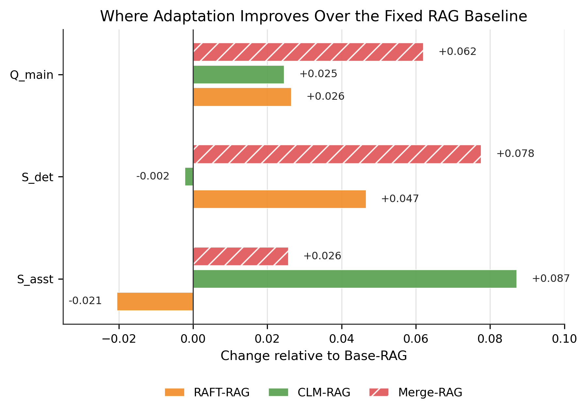
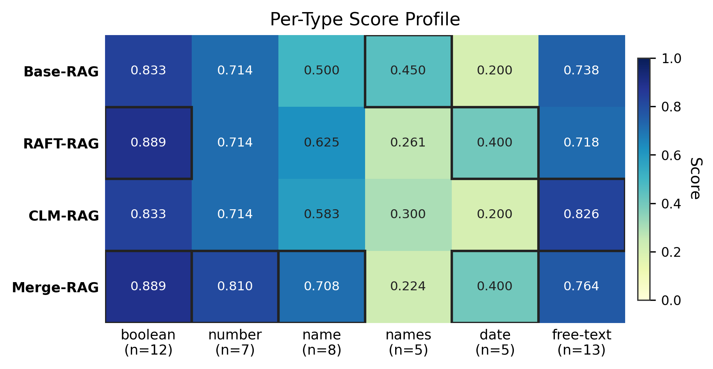

# When Retrieval Is Already in Place: Parametric Adaptation Methods for Document-Grounded Legal QA

Code, data, and experiments for the paper of the same title. The repository is the
technical companion to the article: it holds the retrieval-augmented generation (RAG)
stack, the QLoRA training and evaluation pipelines, the DIFC legal benchmark, and the
scripts that reproduce every table and figure in the paper.

**Paper:** [`When-Retrieval-Is-Already-in-Place.pdf`](./When-Retrieval-Is-Already-in-Place.pdf)
· Author: Aleksandr Loginov · Keywords: RAG, parameter-efficient fine-tuning, QLoRA,
continued pretraining, domain adaptation, legal QA.

---

## What the study asks

The paper studies whether adapting a generator's parameters still adds value once a RAG baseline is already in place, on a legal docs corpus. The retrieval stack, backbone, PEFT architecture, and evaluation set are held constant so the only variable is the training signal.

**RQ1.** Does parametric adaptation improve on a strong RAG baseline, and how do
RAFT-style supervised fine-tuning and supervision-free CLM continued pretraining differ
as retrieval-conditioned generators?

**RQ2.** How far can pure parametric systems reach without retrieval, and does retrieval
remain indispensable?

## Key findings

- **Retrieval is the foundation.** Removing retrieval collapses quality for every adapter
  (Q_main drops from ~0.67 to below 0.27). A 2B backbone cannot internalize the corpus
  well enough to answer without external evidence.
- **The training signal matters more than the adapter itself.** RAFT-style supervision
  improves deterministic extraction (boolean, date, name); CLM continued pretraining
  improves free-text explanation quality. The two gains are orthogonal.
- **A post-hoc adapter merge** combines part of both profiles and gives the strongest
  multi-document reasoning, at higher seed variance. Reported as exploratory.

---

## Systems compared

The paper uses mnemonics; the code and experiment folders use `S*` IDs. The mapping:

| Mnemonic (paper) | Code ID | Experiment | Retrieval | Training signal | Role |
|------------------|---------|------------|-----------|-----------------|------|
| Base-RAG  | S1   | `EXP-002_s1_rag_baseline`     | Yes | none                | Headline baseline |
| RAFT-RAG  | S2+R | `EXP-003_qlora_raft_baseline` | Yes | RAFT-style QA       | Headline |
| CLM-RAG   | S3+R | `EXP-004b_clm_retrieval`      | Yes | CLM on corpus       | Headline |
| Merge-RAG | S7   | `EXP-010_adapter_merge`       | Yes | merged RAFT + CLM   | Post-hoc (exploratory) |
| RAFT-Closed | S2 | `EXP-003b_qlora_closed`       | No  | RAFT-style QA       | Control |
| CLM-Closed  | S3 | `EXP-004_clm_pretraining`     | No  | CLM on corpus       | Control |
| D2L-Closed  | —  | `EXP-004_d2l_monolithic`      | No  | Doc-to-LoRA hypernet| Control (negative finding) |

Headline systems share the same retrieval stack and the same QLoRA configuration
(rank 32, alpha 32, dropout 0.05, targeting `q_proj` and `v_proj`, 4-bit NF4). They
differ only in the adapter's training signal.

---

## Architecture


*Base-RAG routes queries through the shared retrieval stack to the base generator;
RAFT-RAG and CLM-RAG route through the same retrieval to an adapted generator; Merge-RAG
uses a merged adapter; controls bypass retrieval entirely.*

### Retrieval backbone (frozen, shared by all retrieval-aware systems)

The retrieval engine lives in [`src/rag_pipeline/`](src/rag_pipeline) and is driven by the
project wrappers in [`src/retrieval/`](src/retrieval). Five stages:

1. **Ingestion and hierarchical chunking** — PDFs are parsed (PyMuPDF), tables are
   serialized, and documents are split into five chunk families: page, section, clause,
   microchunk (300 tokens, 50-token overlap), and table blocks. Entities, dates, heading
   paths, and BM25 terms are extracted per chunk.
   (`src/rag_pipeline/ingestion`, `src/rag_pipeline/indexing/chunking.py`)
2. **Hybrid retrieval** — dense via Qwen3-Embedding-0.6B (384-dim) + sparse BM25 Okapi
   (k1=1.5, b=0.75); each channel prefetches 30 candidates.
   (`src/rag_pipeline/indexing/embeddings.py`, `retrieval/hybrid_search.py`)
3. **Reciprocal Rank Fusion** — dense and sparse lists fused with equal weights, k=60,
   producing 10 candidates.
4. **Cross-encoder reranking** — Qwen3-Reranker-0.6B reranks the top 10; top 5 retained
   (lexical fallback if the reranker fails). (`src/rag_pipeline/retrieval/reranker.py`)
5. **Evidence compression** — a page-diverse compressor selects up to 3 chunks (at most
   one per physical page); `(doc_id, page_number)` pairs are lifted for grounding.
   (`src/rag_pipeline/retrieval/evidence_compressor.py`, `page_lifter.py`)

The five-stage orchestration for the experiments is in
[`src/retrieval/staged.py`](src/retrieval/staged.py).

### Parametric adaptation

- **RAFT-RAG** (`src/training/qlora.py`, data in `src/data/raft.py`) — QLoRA fine-tuned
  on 150 QA pairs in RAFT format: question + gold evidence chunks + 2 distractor chunks
  → reference answer. LR 2e-4, cosine, 3 epochs, max seq 4096.
- **CLM-RAG** (`src/training/clm.py`) — QLoRA continued pretraining on the raw corpus
  (~115K tokens) with a causal LM objective, no QA labels. LR 5e-5, 5 epochs, max seq 512
  (512 is a VRAM limit: CLM loss over the full ~256K vocabulary at longer sequences
  exceeds 8 GB at the logits stage).
- **Merge-RAG** (`EXP-010`) — linear interpolation of the RAFT and CLM adapters per
  matching seed, `alpha = 0.5`, no additional training.

### Generation and evaluation

- Generation: Gemma-2-2b-it, greedy decoding, max 256 new tokens; constrained decoding
  (Outlines) for boolean and name types. (`src/generation/`)
- Primary metric: **`Q_main = 0.7 · S_det + 0.3 · S_asst`**.
  - `S_det` — deterministic scoring for boolean/date (exact match), number (1% tolerance),
    name (normalized exact match), names (Jaccard). (`src/evaluation/deterministic.py`)
  - `S_asst` — free-text quality judged by GPT-5.4-mini against 5 binary criteria
    (correctness, completeness, grounding, calibration, clarity). (`src/evaluation/judge.py`)
- Grounding: `G = F_β (β=2.5)` on page-level evidence vs gold references, constant across
  retrieval-aware systems because the stack is frozen. (`src/evaluation/grounding.py`)
- Variance: trained systems use 3 seeds (42, 123, 777); results are mean ± std on the
  fixed 50-question evaluation set. (`src/evaluation/seed_stats.py`)

---

## Results

Aggregate results on the 50-question evaluation set (trained systems: mean ± std over
3 seeds). Offline cost is per-seed training wall-clock.

| | Q_main | S_det | S_asst | G | Offline (s) |
|---|---|---|---|---|---|
| **Headline** | | | | | |
| Base-RAG  | 0.643          | 0.601          | 0.739          | 0.567 | — |
| RAFT-RAG  | 0.669 ± 0.014  | 0.648 ± 0.015  | 0.718 ± 0.018  | 0.567 | 1206 |
| CLM-RAG   | 0.667 ± 0.023  | 0.599 ± 0.016  | 0.826 ± 0.062  | 0.567 | 581 |
| **Post-hoc** | | | | | |
| Merge-RAG | 0.705 ± 0.035  | 0.679 ± 0.048  | 0.764 ± 0.018  | 0.567 | n.c.* |
| **Controls** | | | | | |
| RAFT-Closed | 0.263 ± 0.005 | 0.270 | 0.246 | — | 88 |
| CLM-Closed  | 0.185 ± 0.003 | 0.135 | 0.303 | — | 581 |
| D2L-Closed  | 0.210         | 0.135 | 0.385 | — | 3932 |

\* Merge-RAG inherits the combined offline cost of RAFT-RAG and CLM-RAG; the merge itself
is instantaneous.

| | |
|---|---|
|  |  |

RAFT-RAG raises deterministic extraction, CLM-RAG raises free-text quality, and the merge
raises both. On the single- vs multi-document split, RAFT-style supervision and the merge
are the most robust to multi-document composition
(see [`assets/figures/fig05_singledoc_multidoc.png`](assets/figures/fig05_singledoc_multidoc.png)).

Full tables, per-type breakdowns, and supplementary figures are in
[`results/`](results) and regenerated by `EXP-006` and `EXP-007`. The figures are produced
by [`assets/figures/generate_figures.py`](assets/figures/generate_figures.py).

---

## Data

8 DIFC (Dubai International Financial Centre) legal PDFs — 4 statutes/regulations and
4 court judgments — ~176 pages and ~115K tokens total, in [`data/corpus/`](data/corpus).

| # | File | Pages | Tokens | Type |
|---|------|-------|--------|------|
| 1 | doc1_general_partnership_law.pdf | 23 | 13,268 | Statute |
| 2 | doc2_crs_regulations.pdf         | 26 | 22,359 | Regulation |
| 3 | doc3_techteryx_v_aria.pdf        | 25 | 17,445 | Case (first instance) |
| 4 | doc4_bond_v_tr88house.pdf        | 23 | 14,950 | Case (first instance) |
| 5 | doc5_personal_property_law.pdf   | 21 | 13,003 | Statute |
| 6 | doc6_securities_regulations.pdf  | 24 | 11,319 | Regulation |
| 7 | doc7_ozias_v_obadiah.pdf         | 19 | 13,032 | Case (appeal) |
| 8 | doc8_lxt_v_sir_realestate.pdf    | 15 |  9,658 | Case (appeal) |

**Benchmark** ([`data/goldset/goldset.benchmark.json`](data/goldset)): 200 human-authored
QA pairs across six answer types — free_text (53), boolean (48), number (36), name (30),
names (17), date (16). Difficulty: easy 98 / medium 71 / hard 31. Multi-document: 26 (13%).
Unanswerable: 17 (8.5%).

**Split** ([`data/splits/split_v1.json`](data/splits)): a frozen 150-train / 50-eval split,
stratified by answer type, difficulty, and single-/multi-document status. All systems are
evaluated on the same 50 questions; supervised training uses the other 150; CLM training
uses raw corpus text and is independent of the split. RAFT and closed-book training tables
are prebuilt in [`data/processed/`](data/processed). `data/corpus4-100/` and
`data/corpus4_2-100/` hold the goldset-construction history (candidates, drafts, reviews).

---

## Reproduction

### Environment

Requires Python 3.12 and [`uv`](https://docs.astral.sh/uv/). The Torch stack is pinned for
CUDA 12.4 (`torch==2.6.0+cu124`, `transformers==4.51.3`); training and inference target a
single 8 GB GPU.

```bash
uv sync
echo "OPENAI_API_KEY=sk-..." > .env   # used only by the GPT-5.4-mini free-text judge
```

### Hardware

All experiments were run on a single NVIDIA RTX 4060 (8 GB VRAM) with 32 GB system RAM.
The backbone is `google/gemma-2-2b-it`, quantized to 4-bit NF4. Approximate per-seed
training cost: RAFT ~20 min, CLM ~10 min.

### Running experiments

Each experiment is self-contained under `experiments/EXP-XXX/` with a `run.py` or
`main_exp.py` and a local `config.py`. Global defaults (paths, seeds, hyperparameters,
metric weights) are in [`config.py`](config.py). Run from the repository root, e.g.:

```bash
python experiments/EXP-002_s1_rag_baseline/run.py        # Base-RAG: build index + evaluate
python experiments/EXP-003_qlora_raft_baseline/main_exp.py   # RAFT-RAG (3 seeds)
python experiments/EXP-004b_clm_retrieval/main_exp.py        # CLM-RAG (3 seeds)
python experiments/EXP-010_adapter_merge/main_exp.py         # Merge-RAG (post-hoc)
python experiments/EXP-006_main_comparison/main_exp.py       # aggregate tables + deltas
python experiments/EXP-007_error_analysis/main_exp.py        # error analysis + figures
```

Experiment scripts use cell-like `# %%` separators for block-by-block execution.

### D2L-Closed (Doc-to-LoRA control)

The Doc-to-LoRA control (`EXP-004_d2l_monolithic`) uses the upstream SakanaAI hypernetwork.
It runs on **Linux + CUDA only** (the upstream package pulls flash-attn / flashinfer wheels
built for Linux x86-64). Install the optional dependency and run the experiment:

```bash
# upstream package as a pinned git dependency (avoid pulling deepspeed/vllm):
uv pip install --no-deps "git+https://github.com/SakanaAI/doc-to-lora.git@baa85db"
python experiments/EXP-004_d2l_monolithic/main_exp.py
```

The pretrained hypernetwork checkpoint (~1.3 GB) is hosted on the Hugging Face Hub at
[`SakanaAI/doc-to-lora`](https://huggingface.co/SakanaAI/doc-to-lora/tree/main/gemma_demo/checkpoint-80000).
`src/d2l/checkpoint.py` downloads it automatically on first run when no local checkpoint is
present (configurable via `DOC2LORA_HF_REPO` in `config.py`). D2L-Closed is a negative
finding — see Appendix C of the paper for why it is non-competitive at corpus scale.

---

## Repository layout

```
├── When-Retrieval-Is-Already-in-Place.pdf   # the paper
├── config.py                 # global paths, seeds, hyperparameters, metric weights
├── pyproject.toml / uv.lock  # environment (uv, Python 3.12, CUDA 12.4 Torch stack)
├── src/
│   ├── rag_pipeline/         # retrieval engine: ingestion, indexing, retrieval
│   ├── retrieval/            # project wrappers + 5-stage retrieval orchestration
│   ├── training/             # QLoRA RAFT and CLM training
│   ├── generation/           # Gemma-2-2b-it loading, prompting, constrained decoding
│   ├── evaluation/           # deterministic scoring, LLM judge, grounding, seed stats
│   ├── data/                 # goldset I/O, splits, RAFT and closed-book dataset builders
│   └── d2l/                  # Doc-to-LoRA control utilities
├── data/                     # corpus (8 PDFs), goldset, splits, processed train sets
├── experiments/              # EXP-001 … EXP-010, each with its own report
├── results/                  # aggregated outputs, benchmarks, figures
└── assets/figures/           # figures used in this README and the paper
```

---

## Limitations

The findings are bounded to this corpus (8 documents), the 50-question evaluation set,
the Gemma-2-2b-it backbone, and the frozen retrieval stack. Free-text scoring depends on
an LLM judge. See Section 6 of the paper for the full discussion.