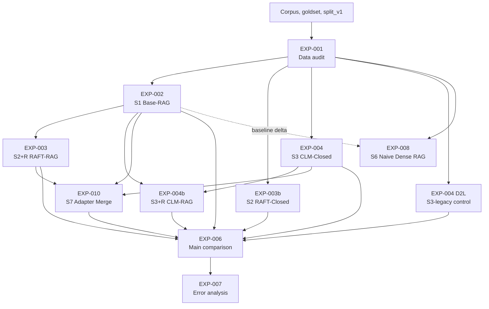

# Experiments

This directory contains the experiment implementations and local reports for the
paper. The folders are organized by experiment ID, but several IDs also map to
system names used in the paper (`S1`, `S2+R`, `S3+R`, and so on).

## Dependency graph

## System map

| System | Experiment folder | Short name | Retrieval | Training signal | Role |
|---|---|---|---|---|---|
| S1 | `EXP-002_s1_rag_baseline` | Base-RAG | Yes | None | Main nonparametric baseline |
| S2+R | `EXP-003_qlora_raft_baseline` | RAFT-RAG | Yes | RAFT-style supervised QA | Headline adapted RAG system |
| S2 | `EXP-003b_qlora_closed` | RAFT-Closed | No | Supervised QA | Closed-book parametric control |
| S3 | `EXP-004_clm_pretraining` | CLM-Closed | No | Causal LM on corpus text | Supervision-free parametric control |
| S3+R | `EXP-004b_clm_retrieval` | CLM-RAG | Yes | CLM adapter from EXP-004 | Headline retrieval-conditioned CLM system |
| S3-legacy | `EXP-004_d2l_monolithic` | D2L-Closed | No | Doc-to-LoRA hypernetwork | Archived negative control |
| S6 | `EXP-008_s6_naive_dense_rag` | Naive Dense RAG | Yes | None | Retrieval ablation |
| S7 | `EXP-010_adapter_merge` | Merge-RAG | Yes | Linear RAFT + CLM adapter merge | Post-hoc merged system |

## Experiment catalog

| Folder | What it represents | Main inputs | Main outputs |
|---|---|---|---|
| `EXP-001_data_audit` | Validates the 8-document corpus, merged 200-question goldset, answer-type distribution, difficulty distribution, evidence references, and frozen split. This is the data readiness gate for the rest of the work. | `data/corpus/`, goldset files, split configuration | Audit report, frozen `data/splits/split_v1.json` |
| `EXP-002_s1_rag_baseline` | Builds the shared RAG baseline: hierarchical chunking, hybrid dense/sparse retrieval, RRF fusion, cross-encoder reranking, evidence compression, and Gemma generation without adapters. It also freezes the retrieval index used downstream. | Corpus PDFs, evaluation split | S1 predictions, evaluation report, system metrics, persisted index in `results/EXP-002/index/` |
| `EXP-003_qlora_raft_baseline` | Trains QLoRA adapters with RAFT-style supervised examples and evaluates them inside the S1 retrieval pipeline. This tests whether supervised parametric adaptation still helps once retrieval is already present. | RAFT train JSONL, S1 index, eval questions | Per-seed RAFT adapters in `models/qlora/`, S2+R predictions and aggregate summary |
| `EXP-003b_qlora_closed` | Uses the supervised QA training signal without retrieval at inference. This isolates how much document knowledge the small adapter can store parametrically. | Closed-book train JSONL, eval questions | Per-seed closed-book RAFT adapters, S2 control predictions and aggregate summary |
| `EXP-004_clm_pretraining` | Trains QLoRA adapters with causal LM continued pretraining on raw corpus text and evaluates them without retrieval. This is the supervision-free parametric control. | Raw corpus text, eval questions | Per-seed CLM adapters in `models/clm/`, S3 predictions and aggregate summary |
| `EXP-004_d2l_monolithic` | Archived Doc-to-LoRA control. It generates per-document D2L adapters, merges them into one monolithic adapter, and evaluates without retrieval. The report marks this as a negative control with a methodology deviation caused by chunk-level workaround. | Corpus documents, D2L checkpoint, eval questions | D2L adapters, merge diagnostics, S3-legacy predictions |
| `EXP-004b_clm_retrieval` | Reuses the CLM adapters from EXP-004 inside the S1 retrieval pipeline. This is the retrieval-conditioned CLM headline system and mirrors EXP-003 with a different training signal. | CLM adapters from EXP-004, S1 index, eval questions | S3+R per-seed predictions and aggregate summary |
| `EXP-006_main_comparison` | Consolidates the main systems into publication tables: headline systems, controls, deltas, per-type scores, single-doc versus multi-doc behavior, latency, VRAM, and offline cost. S6 is intentionally excluded from this main comparison. | Results from EXP-002, EXP-003, EXP-003b, EXP-004, EXP-004b, EXP-004 D2L, EXP-010 | Main comparison CSVs, deltas, plots, `EXP-006_REPORT.md` |
| `EXP-007_error_analysis` | Builds the error-analysis layer on top of the main comparison. It summarizes trade-offs, practical winner calls, control-system caveats, and figure outputs for paper discussion. S6 is also excluded here. | Aggregated outputs from EXP-006 and per-system predictions | Error analysis markdown, deep analysis markdown, paper figures |
| `EXP-008_s6_naive_dense_rag` | Implements a stripped-down dense-only RAG ablation: FAISS, microchunk-only indexing, no BM25, no RRF, no reranker, and no evidence compression. The delta against S1 estimates the value of the full retrieval engineering stack. | Corpus PDFs, eval questions, S1 baseline outputs for comparison | S6 predictions, FAISS index, delta and retrieval-overlap report |
| `EXP-010_adapter_merge` | Creates S7 by linearly merging same-seed RAFT and CLM adapters, then evaluates the merged adapter inside the S1 retrieval pipeline. It is a post-hoc test of whether RAFT's deterministic gains and CLM's free-text gains combine without retraining. | RAFT adapters from EXP-003, CLM adapters from EXP-004, S1 index | Merged-adapter predictions, per-seed summaries, aggregate summary |
