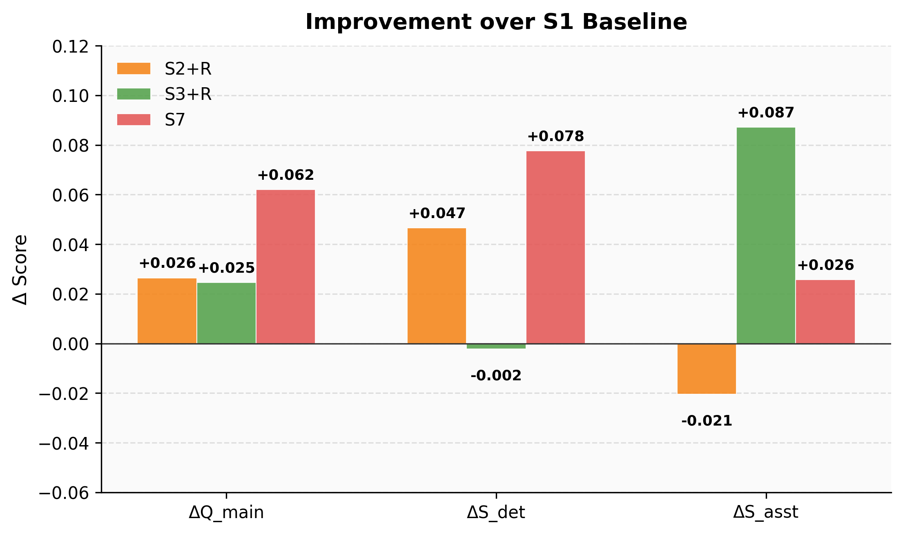
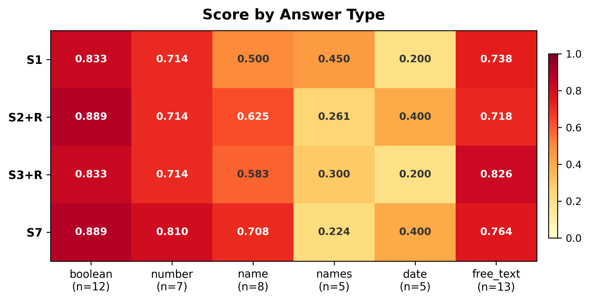
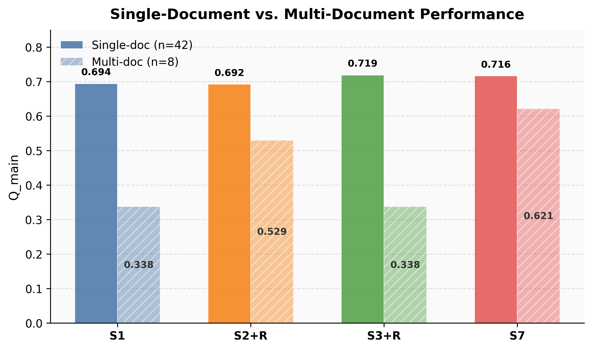
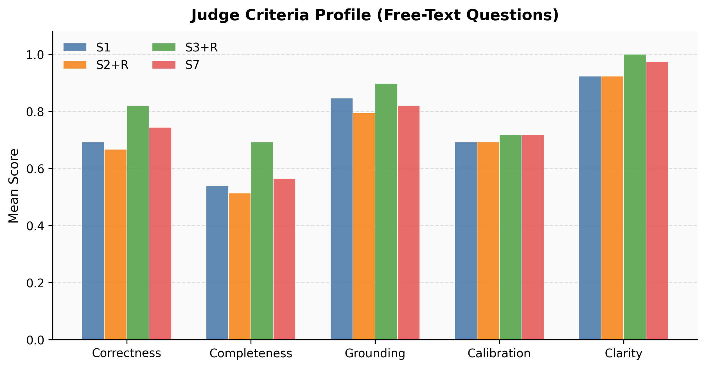

# {Title Page Placeholder}

University, department, module, semester, author details, supervisor details, and submission date should be inserted here according to the institutional template.

---
# Declaration of Academic Integrity Placeholder

The declaration should be inserted here in the exact wording required by the institution.

---
# Table of Contents Placeholder

The final table of contents should be generated after the manuscript structure is fixed.


## 1. Introduction

### 1.1 Problem and Motivation

Document-grounded legal question answering places unusual pressure on both factual precision and answer discipline. The target answer is often tied to a specific provision, date, list element, or procedural distinction, which makes unsupported generation especially costly. In that setting, improvements should not be credited merely because a model appears more fluent. They should be credited only when they improve document-bound answering under controlled conditions.

This constraint becomes more consequential on consumer hardware. When training and inference must fit within an RTX 4060 with 8 GB of VRAM and 32 GB of RAM, the design space shifts away from large-scale retraining and toward retrieval engineering, compact backbones, and parameter-efficient adaptation. The practical research question is therefore whether adaptation remains useful once the baseline is already a strong retrieval-augmented generation pipeline.

The present study addresses that question on a compact legal benchmark built from eight DIFC documents and a frozen evaluation protocol. It asks whether parametric adaptation adds measurable value beyond a strong fixed RAG baseline and whether different adaptation signals produce different quality profiles under the same infrastructure constraints.

### 1.2 Research Questions and Scope

The study is intentionally narrow. It uses one backbone family, one shared retrieval stack, one frozen benchmark split, and one hardware regime in order to isolate the effect of adaptation signal. The benchmark contains eight DIFC legal documents and 200 human-authored question-answer pairs. The final split is fixed at 150 train / 50 eval, and all compared systems are evaluated on the same 50-item evaluation set.

Within that setup, the main comparison is restricted to three retrieval-aware systems that are referred to throughout the paper by short system identifiers: S1, the strong RAG baseline; S2+R, the RAFT-style retrieval-aware adapted system; and S3+R, the CLM-adapted retrieval-aware system. This comparison answers the main research question: whether parametric adaptation improves a strong RAG baseline, and how supervised retrieval-conditioned adaptation differs from supervision-free continued pretraining when both are used inside the same retrieval pipeline. A second research question examines the limits of pure parametric memory by comparing retrieval-aware systems with no-retrieval controls.

The scope is deliberately bounded. The paper does not claim to settle the general value of parametric memory for legal QA, and it does not compare many backbones, retrieval stacks, or training recipes. Its contribution depends on holding those factors constant so that the contrast between adaptation signals remains interpretable.

### 1.3 Contributions

The contribution of the paper is a controlled empirical comparison rather than a new architecture. First, it compares RAFT-style supervised adaptation and CLM continued pretraining on top of the same fixed RAG pipeline, which makes the difference in training signal analytically visible. Second, it quantifies how far pure parametric systems can go without retrieval on the same benchmark and under the same hardware constraints, thereby clarifying whether retrieval remains indispensable. Third, it reports a post-hoc adapter-merge result, S7, as exploratory evidence that supervised and corpus-level adaptation may encode partially complementary strengths, while keeping that result secondary to the headline comparison.

### 1.4 Structure of the Paper

The remainder of the paper follows a compact experimental structure. Section 2 introduces the background needed to position retrieval and parameter-efficient adaptation in document-grounded legal QA. Section 3 describes the benchmark, hardware setting, and fixed retrieval backbone. Section 4 presents the compared systems and the evaluation protocol. Section 5 reports the main empirical results, including the headline comparison, per-type breakdowns, retrieval controls, and the single-document versus multi-document analysis. Section 6 discusses the answers to the research questions, the error topology, and the main limitations. Section 7 concludes. The appendix collects hyperparameters, extra tables and figures, the D2L engineering note, and the disclosure of generative AI use.

## 2. Background and Related Work

### 2.1 RAG as Nonparametric Memory

Retrieval-augmented generation can be treated as a nonparametric memory mechanism [1]. Instead of requiring the model to encode all relevant information in its parameters, the system retrieves external evidence at inference time and conditions generation on that evidence. In legal QA, this distinction is particularly useful because answer quality depends less on open-ended completion ability than on the accurate use of document-bound facts. A system that can recover the relevant pages or clauses at inference time has a direct path to grounded answering that does not rely on internalizing the entire corpus.

That perspective is methodologically important for the present study. The baseline is a retrieval-aware pipeline with hybrid search, reranking, and evidence compression. This means that any gain from downstream adaptation must be interpreted relative to an already strong external memory mechanism. The paper therefore studies parametric adaptation as an addition to nonparametric memory while treating retrieval as the foundation of the comparison, rather than as a competitor to retrieval itself [1].

### 2.2 Parameter-Efficient Adaptation on Consumer Hardware

Parameter-efficient fine-tuning is central to the project because the hardware budget is not incidental. LoRA introduced the low-rank adapter formulation that makes this design possible at all, while QLoRA made it practical under aggressive memory constraints through 4-bit quantization and paged optimization [2, 3]. The implementation-oriented literature also makes clear why that matters on a single modest GPU: practical QLoRA pipelines rely on 4-bit loading, bitsandbytes integration, and careful handling of NF4-based quantization details [18, 19]. Under the present resource constraints, that design is not merely convenient. It is what makes adaptation experimentally feasible without changing the backbone family or requiring large-scale compute.

This constraint also improves interpretability. Because the compared adapted systems rely on the same PEFT basis, differences between them can be attributed to their training signals rather than to different adaptation mechanisms. Survey and review work on parameter-efficient fine-tuning consistently treats this family of methods as a quality-versus-resource trade-off rather than as a single fixed recipe, and both general PEFT surveys and small-model empirical studies reinforce that point under practical resource budgets [4, 5, 6, 7]. The paper therefore treats PEFT as part of the experimental design, not as an optimization detail.

### 2.3 RAFT-style Adaptation vs. CLM Continued Pretraining

The central comparison in this paper is between two adaptation signals. RAFT-style adaptation uses retrieval-conditioned supervision: the model is trained on question-answer examples paired with supporting evidence, so the adaptation objective directly reflects the downstream QA task [8]. In this paper, CLM continued pretraining denotes adapter training by next-token prediction over the corpus text without explicit QA supervision. That second branch is included as an operational contrast to RAFT-style supervision rather than as a claim about a separate named method family in the literature.

Because both approaches are applied to the same backbone and later evaluated inside the same retrieval stack, the contrast isolates a substantive methodological difference. RAFT-style adaptation may favor deterministic extraction because it is trained directly on answer production under evidence conditioning. CLM adaptation may favor assistant-style answer quality because it continues to shape the model's local contextualization behavior without task-specific labels. The empirical question is which of these tendencies becomes visible once both are tested against the same strong RAG baseline.

### 2.4 Research Gap and Positioning

The study is positioned against broad comparisons among abstract memory families. That framing often obscures the more practical question faced in a constrained experimental setting: if a retrieval pipeline is already strong and fixed, does adapter-based adaptation still add value, and what kind of adaptation signal matters most? This paper answers that narrower question under one benchmark, one backbone family, and one hardware regime. Recent legal-domain work has increasingly separated general legal reasoning benchmarks from retrieval-centered legal QA benchmarks and broader RAG evaluation frameworks, which makes this narrower framing methodologically preferable for the present paper [13, 14, 15, 16].

That scope makes the result more controlled, even if it makes the claims less general. The paper does not argue that any single method family is universally best for legal QA. It argues that, on this benchmark and under these constraints, a strong retrieval baseline is difficult to beat, adaptation can still provide moderate gains, and those gains depend on the training signal rather than on the mere presence of an adapter.

## 3. Benchmark and Experimental Setup

### 3.1 Corpus and Benchmark

The benchmark is built from eight DIFC legal documents comprising 176 pages and approximately 115 thousand tokens. The corpus includes statutes, regulations, and case decisions, which gives the evaluation set a mix of local extraction tasks and broader interpretive questions while remaining small enough for controlled experimentation on consumer hardware.

The gold set contains 200 human-authored question-answer pairs. Answer types are distributed across free-text, boolean, number, name, names, and date questions, and the benchmark also includes unanswerable items. Difficulty labels span easy, medium, and hard cases. A total of 26 questions, or 13 percent of the benchmark, require evidence from more than one document. This is a useful property because it creates a natural stress test for systems that may differ in local contextualization versus cross-document aggregation.

The final split is fixed at 150 train / 50 eval. The split is stratified by answer type, difficulty, and the single-document versus multi-document distinction. This frozen split is used throughout the paper. The compact size of the benchmark limits the breadth of claims that can be made, but it also makes controlled cross-system comparison feasible under one hardware regime.

Table 1 should be placed here.

### 3.2 Hardware, Shared Backbone, and Variance Policy

All systems are evaluated under the same hardware constraint: an RTX 4060 with 8 GB of VRAM and 32 GB of RAM. The shared backbone across the active systems is Gemma-2-2b-it. This common infrastructure is important because it removes a large source of confounding variation. The headline systems differ in adaptation signal, not in backbone family or deployment environment.

For trained systems, variance is handled through three random seeds, namely 42, 123, and 777, and mean plus standard deviation is reported where relevant. This variance policy is modest, but it provides a clearer view of stability than a single run would. The evaluation remains anchored to one frozen evaluation split rather than cross-validation, which keeps all compared systems on the same test set.

Detailed hyperparameters are not repeated in the main text because they are not the center of the argument. They are deferred to the appendix, where they support reproducibility without interrupting the logic of the comparison.

### 3.3 Fixed Retrieval Backbone

The retrieval backbone is held constant across all retrieval-aware systems. It combines hybrid dense and sparse retrieval, reciprocal-rank fusion, reranking, and evidence compression. In operational terms, that means S1, S2+R, S3+R, and S7 receive their evidence through the same retrieval pipeline rather than through system-specific retrieval variants.

This frozen retrieval design is essential for interpretation. Because the evidence path is constant, differences among retrieval-aware systems should be read primarily as differences in how the generator uses the same retrieved context. The grounding metric therefore functions as a control on the shared pipeline. The nearly identical grounding values across retrieval-aware systems do not suggest that adaptation is irrelevant. They indicate that the main source of variation lies in generation conditioned on fixed evidence rather than in evidence selection itself.

The retrieval description is kept in prose because the visual budget of the paper is better spent on cross-system comparisons. The main methodological point is that retrieval is strong, shared, and frozen before adaptation results are interpreted.

## 4. Compared Systems and Evaluation Protocol

### 4.1 System Inventory

The compared systems occupy different methodological roles. The headline comparison consists of S1, S2+R, and S3+R. S1 is the strong nonparametric baseline, S2+R is the supervised retrieval-aware adapter trained with RAFT-style open-book supervision, and S3+R is the retrieval-aware CLM adapter obtained through continued pretraining on the corpus text. These three systems define the main thesis comparison.

S7 is reported separately as an exploratory post-hoc result. It is obtained by linearly merging the CLM and RAFT adapters without retraining, then evaluating the merged adapter inside the same S1 retrieval stack. Because S7 inherits prior training effort and is not a separately trained system, it is reported outside the headline branch.

The pure parametric systems S2 and S3 serve as controls. They clarify the limits of parametric memory without retrieval rather than competing for the main claim. The legacy D2L branch, labeled S3-legacy in comparison tables, is retained as an engineering negative control. It documents a non-competitive document-conditioned packaging route under the present implementation constraints and is conceptually related to recent context-to-adapter internalization proposals such as Doc-to-LoRA [9]. Table 2 summarizes this system inventory.

Table 2 provides the compact legend for the system identifiers used throughout the remainder of the manuscript.

| System | Full description | Retrieval | Training signal | Role in paper |
|---|---|---|---|---|
| S1 | Strong classical RAG baseline | Yes | None | Headline |
| S2+R | RAFT-style QLoRA adapter inside the fixed RAG pipeline | Yes | Supervised retrieval-conditioned QA training | Headline |
| S3+R | CLM adapter inside the fixed RAG pipeline | Yes | Continued pretraining on corpus text | Headline |
| S7 | Post-hoc merge of CLM and RAFT adapters | Yes | No training; linear adapter interpolation | Exploratory post-hoc |
| S2 | Closed-book supervised QLoRA control | No | Supervised QA training without retrieval | Control |
| S3 | Closed-book CLM control | No | Continued pretraining on corpus text without retrieval | Control |
| S3-legacy | Legacy D2L branch | No | Document-conditioned adapter generation with workaround packaging | Legacy control |

### 4.2 Training Setups

The adapted systems differ in signal rather than in surrounding scaffolding. S2+R is trained with retrieval-conditioned supervision built from the 150 train portion of the benchmark. Each training instance pairs a question with gold evidence chunks and distractors, and the model is trained to produce the answer from that evidence-conditioned prompt. This makes the training objective closely aligned with downstream document-grounded QA.

S3 is trained differently. Its adapter is learned through causal language modeling on the concatenated text of all eight corpus documents, without question-answer labels. The corresponding retrieval-aware system S3+R then uses that adapter inside the fixed S1 retrieval pipeline. This yields a symmetric comparison with S2+R: same backbone, same PEFT basis, same retrieval pipeline, but a different adaptation signal.

The no-retrieval controls remove retrieval at inference time and thereby measure the limits of internalized or partially internalized knowledge. The D2L branch is described only briefly in the main text because its full engineering details do not pay for their page budget here. The relevant point is that a token-level audit suggested single-pass feasibility, but the released implementation imposed stricter effective limits in practice, which required chunked packaging and left D2L as a legacy negative control. Full training details and hyperparameters are reported in Appendix A.

### 4.3 Evaluation Protocol

The evaluation combines aggregate answer quality, component-level answer quality, grounding, and practical systems metrics. The primary score is Q_main, defined as 0.7 times S_det plus 0.3 times S_asst. This weighting prioritizes deterministic extraction while still crediting assistant-style quality on free-text answers. S_det captures exact or near-exact correctness for deterministic answer types such as boolean, number, name, names, and date. Number answers are scored with exact match under a 1 percent tolerance, boolean and date answers require exact normalized matches, single names use normalized exact string match, and multi-name answers use Jaccard similarity over normalized sets.

Unanswerable items are handled differently depending on answer type. For deterministic unanswerable questions, the gold answer is null and the expected system output is []; a system receives 1.0 only when it returns [], and 0.0 otherwise. Free-text negative questions remain part of the judged free-text subset rather than of S_det. They are therefore scored through the same assistant-style pipeline as other free-text answers, with the calibration criterion rewarding an explicit statement that the requested information is absent or unsupported.

S_asst is computed only on the free-text subset. Each free-text answer is judged by gpt-5.4-mini through a frozen prompt and a five-criterion binary rubric covering correctness, completeness, grounding, confidence calibration, and clarity or relevance. The per-question S_asst score is the mean of these five binary criteria, and the reported system-level S_asst is the mean across all free-text questions. The judge prompt is identical for all systems, malformed judge output is retried once before being scored as zero, and a manual audit was performed on a sample of judged responses before final interpretation. This use of an LLM judge follows the same broad methodological direction as recent legal-domain evaluation work that treats judge-based scoring as a practical instrument for rapid comparative assessment [17].

Grounding is reported only for retrieval-aware systems and is measured as page-level F-beta with beta equal to 2.5. In this paper, grounding should be read as a control on the fixed retrieval backbone rather than as a primary differentiator among retrieval-aware systems. Because S1, S2+R, S3+R, and S7 share the same retrieval stack, identical grounding values indicate common evidence access rather than identical generation behavior.

The protocol also records systems metrics such as time to first token, end-to-end latency, peak inference VRAM, and offline cost. These metrics matter for practical interpretation, but the paper avoids collapsing them into a misleading latency-only cost narrative. Instead, quality and resource expenditure are interpreted together, with direct offline-cost comparison restricted to systems that are genuinely comparable in training or packaging effort.

## 5. Results

### 5.1 Main Comparison

The main comparison begins with a strong baseline. S1 reaches a Q_main of 0.6425, with S_det at 0.6014 and S_asst at 0.7385, which establishes a difficult starting point for any adapted retrieval-aware system. Against that baseline, both headline adapted systems provide moderate but meaningful improvement. S2+R reaches 0.6689 ± 0.0137, while S3+R reaches 0.6671 ± 0.0229. The size of the gain is not large, but that is precisely what makes it informative in this setup: the baseline is already strong, and improvements are measured against a fixed retrieval stack rather than against a weak generator-only system.

The two headline adapted systems remain close in aggregate quality. S2+R holds a marginal aggregate edge over S3+R, but the difference is too small to support a claim of practical dominance. The observed pattern is better interpreted as a trade-off among answer-quality dimensions.

S7 reaches the highest observed aggregate score at 0.7045 ± 0.0345, with S_det at 0.6790 ± 0.0481 and S_asst at 0.7641 ± 0.0178. That result is reported after the headline comparison because S7 is a post-hoc adapter merge rather than a separately trained system. It strengthens the case for partial complementarity between the two adaptation signals, but it does not redefine the central comparison on which the paper's main claim depends.

Table 3 summarizes the main comparison.

| System | Role | Q_main | S_det | S_asst | G | Latency median (ms) | Offline cost (s) |
|---|---|---:|---:|---:|---:|---:|---:|
| S1 | Headline | 0.6425 | 0.6014 | 0.7385 | 0.5667 | 479.3 | 0.0 |
| S2+R | Headline | 0.6689 ± 0.0137 | 0.6479 ± 0.0150 | 0.7179 ± 0.0178 | 0.5667 | 492.0 ± 2.0 | 1205.5 ± 29.7 |
| S3+R | Headline | 0.6671 ± 0.0229 | 0.5991 ± 0.0156 | 0.8256 ± 0.0622 | 0.5667 | 525.3 ± 17.6 | 581.4 ± 0.7 |
| S7 | Exploratory post-hoc | 0.7045 ± 0.0345 | 0.6790 ± 0.0481 | 0.7641 ± 0.0178 | 0.5667 | 527.2 ± 19.0 | not directly comparable |
| S2 | Control | 0.2630 ± 0.0046 | 0.2703 | 0.2462 ± 0.0154 | N/A | 257.1 ± 33.7 | 87.9 ± 1.0 |
| S3 | Control | 0.1854 ± 0.0027 | 0.1351 | 0.3026 ± 0.0089 | N/A | 195.2 ± 1.8 | 581.4 ± 0.7 |
| S3-legacy | Legacy control | 0.2100 | 0.1351 | 0.3846 | N/A | 179.4 | 3932.3 |

S7 is excluded from direct offline-cost comparison because it inherits prior adaptation cost from both S2+R and S3+R.

### 5.2 Trade-off Between RAFT-style and CLM Adaptation

The central scientific result of the paper is the difference in quality profile between RAFT-style adaptation and CLM continued pretraining. S2+R reaches a higher deterministic score than S3+R, with S_det values of 0.6479 ± 0.0150 and 0.5991 ± 0.0156 respectively. S3+R, however, reaches a substantially higher assistant-style quality score, with S_asst at 0.8256 ± 0.0622 compared with 0.7179 ± 0.0178 for S2+R. The systems are therefore close in Q_main while behaving differently at the component level.

The delta-to-S1 view makes this contrast clearer. Relative to the baseline, S2+R improves Q_main by 0.0265 and S_det by 0.0466, while slightly reducing S_asst by 0.0205. S3+R improves Q_main by 0.0246 and S_asst by 0.0872, while leaving S_det slightly below the baseline by 0.0023. This pattern supports the interpretation that training signal matters more than the mere presence of an adapter. RAFT-style supervision appears to strengthen deterministic extraction, whereas CLM adaptation appears to strengthen free-text response quality.

The practical interpretation remains mixed. The comparison records a tie on Q_main and grounding between S2+R and S3+R, with S2+R favored on deterministic extraction and S3+R favored on assistant-style quality and offline cost. The offline cost difference is substantial, with S2+R at 1205.5 seconds and S3+R at 581.4 seconds. Under consumer-hardware constraints, that asymmetry matters. The result therefore supports a bounded conclusion: both adaptation strategies add value over strong RAG, but they do so through different quality profiles and different practical costs.



*Figure 2. Delta-to-S1 Bar Chart.*

### 5.3 By Answer Type

Aggregate scores hide several material behavioral differences. On free-text questions, S3+R reaches the strongest assistant-style score at 0.8256 ± 0.0622, clearly above S1 at 0.7385 and S2+R at 0.7179 ± 0.0178. This supports the interpretation that CLM continued pretraining helps local contextualization and discourse quality when the answer requires synthesized prose. By contrast, S2+R improves several deterministic categories relative to the baseline, including boolean questions at 0.8889 and date questions at 0.4000, while S3+R remains closer to the baseline on those answer types.

The per-type breakdown also shows that none of the systems is uniformly strong. The names category remains difficult for the adapted systems, with both S2+R and S3+R underperforming S1 there, and multi-name extraction remains unstable across the board. S7 performs best on number and name questions, but that improvement is reported as secondary because the system is post-hoc. The main interpretive point is that near-equal aggregate scores conceal distinct answer behaviors that align with the different adaptation signals.



*Figure 3. Per-Type Score Heatmap.*

### 5.4 Retrieval Contribution and the Limits of Pure Parametric Memory

Retrieval remains indispensable on this benchmark. The supervised control S2 reaches only 0.2630 ± 0.0046 in Q_main, whereas S2+R reaches 0.6689 ± 0.0137. The CLM control S3 performs even worse at 0.1854 ± 0.0027, while S3+R reaches 0.6671 ± 0.0229. The deltas are large: retrieval adds 0.4059 Q_main points to the supervised system and 0.4817 Q_main points to the CLM system. These gaps are too large to treat retrieval as a minor convenience or as a redundant supplement to parametric adaptation.

The legacy D2L branch supports the same conclusion from a separate engineering path. S3-legacy reaches a Q_main of 0.2100, with S_det at 0.1351 and S_asst at 0.3846. Although the D2L implementation is not directly comparable to the active CLM setup, it remains useful as a negative control. The result indicates that document-internalized adaptation without retrieval did not become competitive in this implementation regime, and the main thesis of the paper does not depend on it doing so.

### 5.5 Multi-Document Difficulty

The split between single-document and multi-document questions yields one of the clearest analytical results in the paper. Multi-document questions are substantially harder for all headline systems. S1 drops from 0.694 on single-document items to 0.338 on multi-document items. S3+R shows a similar contrast, moving from 0.719 to 0.338. S2+R remains lower on single-document questions than S3+R, at 0.692, but it retains more quality on multi-document questions, reaching 0.529. This difference is important because it reveals a sharper behavioral distinction than the aggregate table alone.

The contrast supports a bounded complementarity interpretation. CLM adaptation appears strongest when the task is local and context-sensitive within a single document, while RAFT-style supervision appears more robust when the answer depends on aggregation or comparison across documents. S7 reaches 0.716 on single-document questions and 0.621 on multi-document questions, which is consistent with partial combination of both effects. Even so, the headline analytical result belongs to the contrast between S2+R and S3+R, not to the merged system.



*Figure 4. Single-doc vs Multi-doc Comparison.*

### 5.6 Exploratory Adapter Fusion

The merged adapter provides evidence that the two adaptation signals are not redundant. Relative to S2+R, S7 improves Q_main by 0.0356, S_det by 0.0310, and S_asst by 0.0462. Relative to S3+R, it improves Q_main by 0.0374 and S_det by 0.0799, while reducing S_asst by 0.0615. This pattern is consistent with partial complementarity: the merged system appears to preserve some of the CLM advantage in assistant-style quality while recovering part of the deterministic advantage associated with RAFT-style supervision. The result is also methodologically consistent with recent work on LoRA merging and lightweight skill composition, although the present paper uses only a simple linear merge rather than a more elaborate composition strategy such as task-aware adapter composition or online continual merging [10, 11, 20, 21].

The result remains exploratory for two reasons. First, S7 is a post-hoc merge rather than a separately trained system. Second, its practical cost is not directly comparable to the headline systems because it inherits prior adaptation cost from both source adapters. For that reason, the merged system supports interpretation rather than practical winner selection. Recent work has also argued that desirable properties in adapter merging are more subtle than simple orthogonality or naive composition heuristics alone, which further justifies treating S7 as a bounded exploratory result rather than as a definitive recipe [12]. The main claim of the paper remains intact without S7, which is the correct standard for treating it as a secondary finding.

## 6. Discussion and Limitations

### 6.1 Answer to RQ1

The results indicate that parametric adaptation does add value beyond a strong RAG baseline within this setup. Both S2+R and S3+R improve over S1 in Q_main, but the gain is moderate rather than transformative. That magnitude is important. Because S1 is already a strong baseline, modest gains are more informative than they would be in a weak-baseline setting. They indicate that adaptation can still matter after retrieval is strong, but they do not support the claim that retrieval-aware adaptation fundamentally changes the problem.

The value of adaptation is best understood as a change in quality profile. RAFT-style supervision raises deterministic extraction, while CLM continued pretraining raises assistant-style answer quality. The paper therefore answers RQ1 positively, but in a qualified form: parametric adaptation is useful on top of strong RAG, and the specific training signal matters more than the mere fact that an adapter is present.

### 6.2 Answer to RQ2

RQ2 asks whether pure parametric systems can substitute for retrieval on this benchmark. The answer is negative within the present setup. Both retrieval-free controls perform far below the retrieval-aware systems, and the deltas between S2 and S2+R as well as between S3 and S3+R are large enough to make the conclusion unambiguous. Retrieval remains the dominant memory mechanism for this document-grounded legal QA task.

This conclusion should be stated narrowly. It applies to the evaluated corpus, split, backbone, and hardware regime. It does not imply that parametric memory is irrelevant in general. It indicates that, on this benchmark, retrieval is indispensable as the main carrier of document knowledge, while parametric adaptation is better interpreted as a complementary method for improving how retrieved evidence is used.

### 6.3 Error Analysis

Error overlap clarifies both the shared difficulty of the benchmark and the limits of any single system improvement. Fifteen evaluation questions are answered incorrectly by all headline systems, which indicates that a substantial portion of the remaining difficulty is benchmark-level rather than model-specific. At the same time, the overlap is not total. Two questions are answered correctly only by S1, two only by S3+R, and none only by S2+R or only by S7. This distribution suggests that local non-overlapping strengths exist, but they are sparse and do not overturn the aggregate-level interpretation.

The qualitative failures support the same conclusion. Recurrent misses include multi-document synthesis, date recovery, and exact name or form-list extraction. Several of these errors persist even when retrieval is available, which implies that access to evidence is necessary but not sufficient. Some failures reflect remaining difficulty in mapping retrieved context to precise answer behavior, while others likely reflect the compactness of the benchmark and the limited number of examples for harder question types.

### 6.4 Limitations

The findings are bounded in several straightforward ways. The benchmark is compact, the evaluation split is fixed, and the study uses one backbone family under one hardware regime. Free-text scoring depends on a frozen judge rubric rather than on human adjudication for every answer. The retrieval stack is fixed across retrieval-aware systems, which strengthens interpretability but limits how far the conclusions can speak to alternative retrieval designs. The merged adapter result is also bounded because S7 is post-hoc and inherits prior adaptation cost.

The D2L branch should be read even more narrowly. It supports a negative finding for the present implementation and engineering regime, not a broad claim about document-conditioned adapter generation in general. More broadly, the paper studies a compact legal corpus rather than a large or heterogeneous legal benchmark, so the conclusions should be understood as benchmark-specific and hardware-specific rather than universal.

## 7. Conclusion

### 7.1 Main Findings

This study examined whether parametric adaptation adds value beyond a strong fixed RAG baseline for document-grounded legal QA under consumer-hardware constraints. The results support three main conclusions. First, the RAG baseline is already strong and difficult to surpass. Second, parametric adaptation does provide additional value, but that value depends on the adaptation signal rather than on adapter use alone. RAFT-style supervision is associated with stronger deterministic extraction, whereas CLM continued pretraining is associated with stronger assistant-style answer quality. Third, retrieval remains indispensable, because retrieval-free controls perform far below the retrieval-aware systems.

The exploratory merged-adapter result suggests that the two adaptation signals capture partially complementary strengths. Even so, the scientific contribution of the paper does not depend on the merged system. The practical takeaway is therefore compact: when retrieval is already strong, adaptation can still improve quality, but the relevant decision is which quality profile is needed and whether the additional offline cost is justified under the available hardware budget.

## References

[1] Lewis et al. "Retrieval-Augmented Generation for Knowledge-Intensive NLP Tasks" (2020).

[2] Hu et al. "LoRA: Low-Rank Adaptation of Large Language Models" (ICLR 2022).

[3] Dettmers et al. "QLoRA: Efficient Finetuning of Quantized LLMs" (arXiv 2305.14314).

[4] "Parameter-Efficient Fine-Tuning for Large Models: A Comprehensive Survey" (arXiv 2403.14608).

[5] "Parameter-Efficient Fine-Tuning Methods for Pretrained Language Models: A Critical Review and Assessment" (arXiv 2312.12148).

[6] "Empirical evaluation of low-rank adaptation for efficient fine-tuning of large language models" (Turing Technical Report).

[7] "Parameter-Efficient Fine-Tuning in Large Models: A Survey of ..." (arXiv 2410.19878; title as listed in the provided bibliography).

[8] Zhang et al. "RAFT: Adapting Language Model to Domain Specific RAG" (arXiv 2403.10131).

[9] "Doc-to-LoRA: Learning to Instantly Internalize Contexts" (arXiv 2602.15902).

[10] "Merging LoRAs for Practical Skill Composition Tasks" (CAT, 2024).

[11] "Merging LoRAs like Playing LEGO: Pushing the Modularity of LoRA to Extremes Through Rank-Wise Clustering" (2024).

[12] "Rethinking Inter-LoRA Orthogonality in Adapter Merging" (2025).

[13] "LegalBench: A Collaboratively Built Benchmark for Measuring Legal Reasoning in Large Language Models" (2023).

[14] "LegalBench-RAG: A Benchmark for Retrieval-Augmented Generation in the Legal Domain" (arXiv HTML entry 2408.10343v1).

[15] "LRAGE: Holistic Evaluation of RAG Systems in the Legal Domain" (paper entry listed in the provided bibliography as arXiv 2504.01840 mirror, 2025).

[16] "Legal RAG Bench: an end-to-end benchmark for legal RAG" (2025).

[17] "LLM-as-a-Judge: Rapid Evaluation of Legal Document ..." (arXiv HTML entry 2509.12382v1; title as listed in the provided bibliography).

[18] Hugging Face blog. "Making LLMs even more accessible with bitsandbytes, 4-bit ..." (implementation-oriented QLoRA note listed in the provided bibliography).

[19] McCormick. "QLoRA and 4-bit Quantization" (2024 technical explainer listed in the provided bibliography).

[20] "Task-Aware LoRA Adapter Composition via Similarity Retrieval in Vector Databases" (2026).

[21] "K-Merge: Online Continual Merging of Adapters for On-device Large ..." (title as listed in the provided bibliography).

## Appendix

### Appendix A - Hyperparameters and Prompts

Appendix A records the fixed training and evaluation settings needed to interpret the comparison as a same-scaffolding, different-signal study.

All adapted systems use the same base model family, Gemma-2-2b-it, under 4-bit NF4 QLoRA. Across active systems, the shared PEFT basis is rank 32, alpha 32, dropout 0.05, and target modules q_proj and v_proj. The same three seeds, 42, 123, and 777, are used for trained systems.

For S2+R, the adapter is trained on the frozen 150-question RAFT-style training split. The optimizer is paged AdamW 8-bit with learning rate 2e-4, cosine schedule, warmup ratio 0.03, weight decay 0.01, maximum sequence length 4096, and 3 epochs. The effective batch size is 4 under the consumer-GPU constraint. Training examples use question-answer supervision with gold page-family chunks plus two frozen distractor page-family chunks from non-gold documents.

For S2, the closed-book supervised control, the optimizer and PEFT settings are intentionally matched to S2+R: learning rate 2e-4, cosine schedule, warmup ratio 0.03, weight decay 0.01, maximum sequence length 4096, 3 epochs, and effective batch size 4 through micro-batch 1 with gradient accumulation 4. The only controlled difference relative to S2+R is the training data format, which omits retrieved context and trains on question-to-answer pairs alone.

For S3 and S3+R, the adapter is trained once through causal language modeling on the concatenated eight-document corpus of approximately 115K tokens and then reused either without retrieval or inside the fixed retrieval stack. The training configuration uses learning rate 5e-5, paged AdamW 8-bit, cosine schedule, warmup ratio 0.1, weight decay 0.01, maximum sequence length 512, 5 epochs, per-device batch size 1, and gradient accumulation 4. The shorter sequence length is not a modeling preference but a hardware constraint: CLM computes loss over all tokens, and longer sequences exceeded the 8 GB VRAM budget at the logits stage.

The judge used for S_asst is gpt-5.4-mini, version-pinned at experiment start and run with medium reasoning. The frozen rubric has five binary criteria: correctness, completeness, grounding, confidence calibration, and clarity. For each free-text question, the judge returns a JSON object with one binary value per criterion, and the per-question S_asst is the mean of these five values. The system-level S_asst is the mean across all free-text questions. The prompt used in evaluation can be summarized as follows:

```text
System: You are an impartial judge evaluating a legal QA system's response.
Score each criterion as 1 or 0 and return only JSON.

Inputs:
- Question
- Reference answer
- System response

Criteria:
- correctness
- completeness
- grounding
- calibration
- clarity
```

Malformed judge output is retried once; if the retry also fails, all five criteria are scored as zero for that answer. Judge-based scoring is never used for deterministic answer types. Deterministic unanswerable items are scored through the parser-level [] rule, while free-text negative items remain in the judged subset and are evaluated under the same five-criterion rubric, including calibration.

### Appendix B - Extra Tables and Figures

Appendix Table B1 should summarize the practical trade-off among S1, S2+R, S3+R, S2, and S3. S7 should not appear in the cost-comparable body of that table because it inherits prior training cost from both source adapters. Appendix Figure B3 presents the judge criteria profile. Additional auxiliary figures should be added only if they directly support a discussion point in the main text.



*Appendix Figure B3. Judge Criteria Profile.*

### Appendix C - D2L Engineering Note

This appendix should explain that D2L was originally intended to test document-conditioned adapter generation, but the implemented system required chunk-level workaround packaging in practice. The note should state plainly that the branch is retained as a legacy engineering diagnostic and negative control rather than as a headline result.

### Appendix D - Use of Generative AI

This appendix should name the tools used, describe the scope of assistance, and state that responsibility for the final manuscript remains with the author. If the institutional template requires explicit marking of substantially AI-assisted passages in the manuscript itself, that marking should be applied during the final formatting pass.
