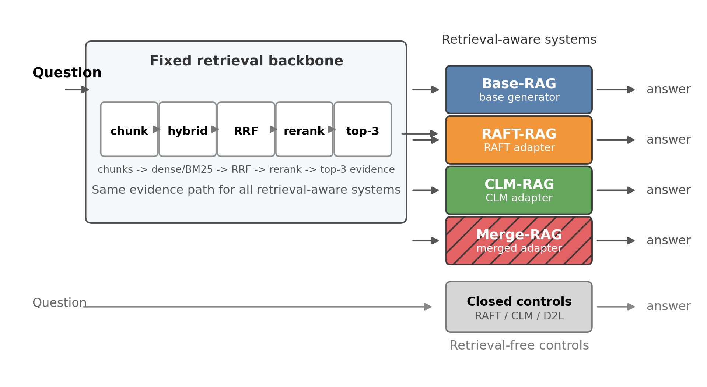
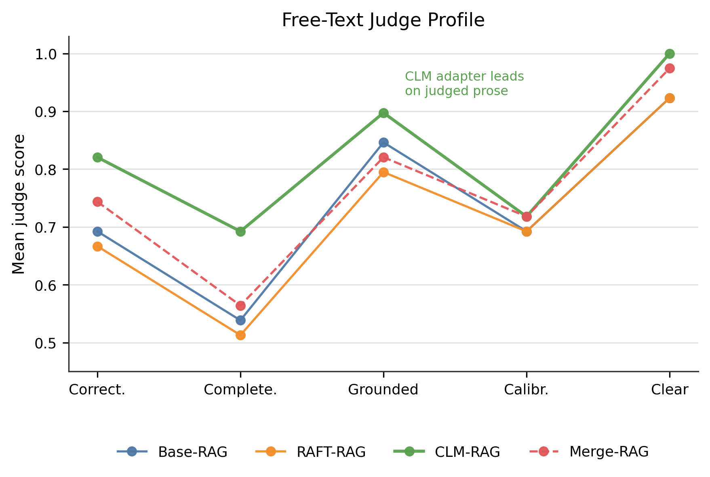
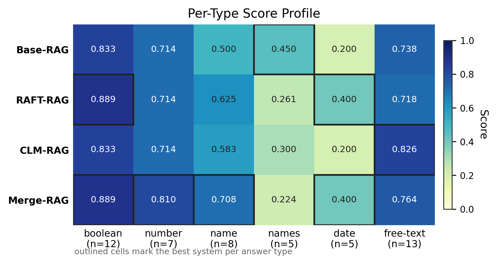
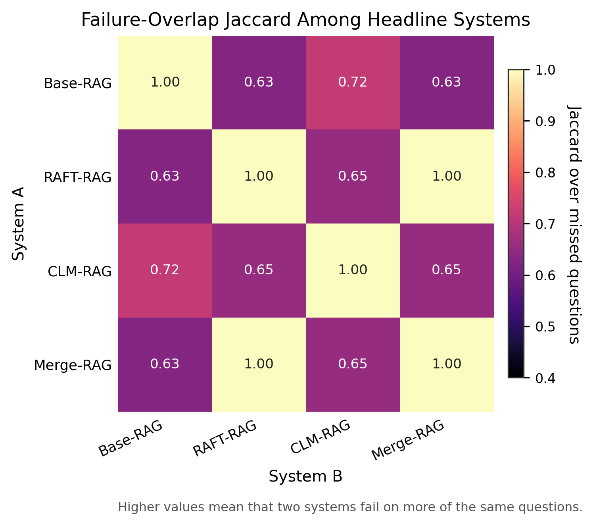
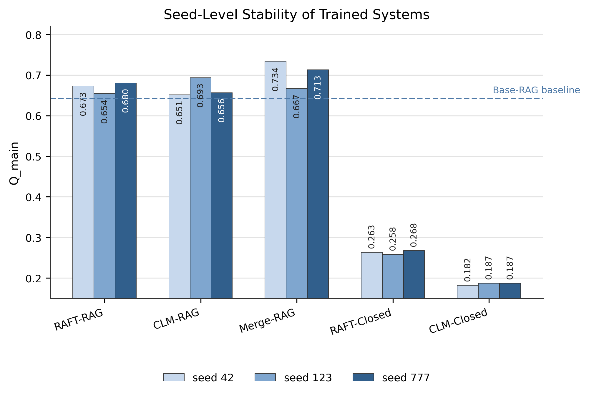
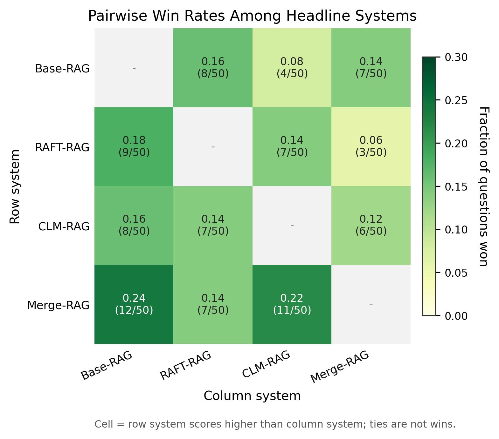

# Abstract

Document-grounded legal question answering on consumer hardware requires balancing factual precision with strict resource constraints. While Retrieval-Augmented Generation (RAG) is the standard nonparametric approach, the exact value and optimal training signal of additionally adapting the generator's parameters remain unclear when a strong retrieval backbone is already in place. This study presents a controlled empirical comparison of two parameter-efficient adaptation paradigms — RAFT-style supervised fine-tuning and unsupervised Causal Language Modeling (CLM) continued pretraining — applied to a frozen 2-billion-parameter backbone (Gemma-2-2b-it) within an 8 GB VRAM budget. Using a compact benchmark based on the DIFC regulatory corpus, the retrieval stack is held constant to isolate the effect of the training signal.

The results demonstrate that retrieval is a foundational prerequisite; pure parametric models suffer severe performance collapse without it. However, applying parametric adaptation on top of a strong RAG baseline shapes how the model uses retrieved context rather than injecting new knowledge. The two training signals improve orthogonal quality dimensions: RAFT-style supervision optimizes deterministic extraction (e.g., boolean and date questions), whereas CLM pretraining substantially improves free-text synthesis and explanation quality. A post-hoc merge of the two adapters partially combines these gains: it recovers the deterministic advantage and yields the strongest multi-document reasoning, though with higher seed variance and without retaining the CLM adapter's edge on free-text quality. Under hardware constraints, rather than treating adaptation as a universal upgrade, practitioners should match the training signal to the required answer profile and can use adapter fusion to combine complementary strengths.

# Table of Contents

1. Introduction
2. Background and Related Work
3. Benchmark and Experimental Setup
4. Compared Systems and Evaluation Protocol
5. Results
6. Discussion and Limitations
7. Conclusion
- References
- Appendix A: Hyperparameters and Prompts
- Appendix B: Supplementary Tables and Figures
- Appendix C: Fundamental Limitations of Doc-to-LoRA
- Appendix D: Use of Generative AI


## 1. Introduction

### 1.1 Problem and Motivation

Document-grounded legal question answering requires both factual precision and answer discipline. The target answer is frequently tied to a specific provision, date, list element, or procedural distinction, so unsupported generation is costly. Improvements should be credited when they strengthen document-bound answering under controlled conditions.

This constraint becomes more consequential on consumer hardware. When training and inference must fit within a single 8 GB GPU, scaling to larger language models is not an option, and the design space shifts toward retrieval engineering, compact backbones, and parameter-efficient adaptation. Practitioners then face a concrete engineering choice: invest in a strong retrieval-augmented generation (RAG) pipeline, apply parameter-efficient fine-tuning to the generator, or combine both.

This study investigates whether parametric adaptation retains practical value when the baseline is already a strong document-grounded RAG system. The relevant question is not whether RAG helps but whether additionally adapting the generator's parameters yields gains once the retrieval backbone is already strong, and whether different adaptation signals produce different quality profiles under identical infrastructure constraints.

### 1.2 Research Questions and Scope

To isolate the effect of parametric adaptation from confounding factors, the study adopts a narrow scope: one compact legal benchmark, one frozen language model backbone, one hardware configuration, and one fixed retrieval stack. Within this controlled setting, two research questions guide the investigation:

**RQ1.** Does parametric adaptation yield gains over a strong RAG baseline on a compact legal benchmark under consumer-hardware constraints, and how do RAFT-style supervised adaptation and supervision-free CLM continued pretraining differ as retrieval-conditioned generators?

**RQ2.** How far can pure parametric systems reach without retrieval on this benchmark, and does retrieval remain indispensable?

The benchmark comprises 8 legal documents from the Dubai International Financial Centre (DIFC) regulatory corpus and 200 human-authored QA pairs spanning six answer types. All systems share the same frozen 50-question evaluation set, while supervised training uses the remaining 150 questions. This narrow scope permits a controlled comparison of training signals under identical infrastructure. The paper does not claim to settle the general value of parametric memory for legal QA, and it does not compare multiple backbones, retrieval stacks, or training recipes; its contribution depends on holding those factors constant so that the contrast between adaptation signals remains interpretable.

### 1.3 Contributions

The contribution of the paper is a controlled empirical comparison. Specifically:

1. A controlled comparison between RAFT-style supervised adaptation and CLM continued pretraining on top of an identical RAG backbone, isolating the training-signal package (the training objective together with the data it is applied to) as the variable under study while holding the backbone, retrieval stack, and PEFT architecture fixed.
2. A quantification of the limits of pure parametric memory by contrasting retrieval-aware systems against no-retrieval controls, thereby clarifying whether retrieval remains indispensable in this setting.
3. A post-hoc adapter-merge result suggesting partial complementarity between the two training signals, reported as an exploratory finding that remains secondary to the headline comparison.

### 1.4 Structure of the Paper

Section 2 provides background on RAG, parameter-efficient adaptation, and the two training paradigms under comparison. Section 3 describes the benchmark corpus, hardware constraints, and the fixed retrieval backbone. Section 4 defines the compared systems and the evaluation protocol. Section 5 presents the experimental results, including aggregate comparisons, per-type analyses, and a single-document versus multi-document breakdown. Section 6 discusses the findings in light of the research questions, analyzes common error patterns, and acknowledges the study's limitations. Section 7 concludes with practical takeaways and directions for future work.


## 2. Background and Related Work

### 2.1 RAG as Nonparametric Memory

Retrieval-augmented generation (RAG) delegates document knowledge to an external retrieval pipeline rather than requiring the generator to memorize corpus content in its parameters (Lewis et al., 2020). At inference time, a query is used to retrieve relevant passages from an indexed corpus, and the retrieved evidence is prepended to the generator's input context. The generator then conditions its output on both the query and the retrieved text.

For legal QA, this externalization is particularly attractive because answers must be traceable to specific regulatory provisions. A RAG system can, in principle, cite the pages from which an answer was derived, providing a form of evidence grounding that purely parametric systems lack. On consumer hardware, where model size is constrained, retrieval also compensates for the limited world knowledge that a compact model can encode in its parameters.

This perspective is methodologically important for the present study. The baseline is a retrieval-aware pipeline with hybrid search, reranking, and evidence compression; any gain from downstream adaptation must therefore be interpreted relative to an already strong external memory mechanism. The paper studies parametric adaptation as an *addition* to nonparametric memory, treating retrieval as the foundation of the comparison.

### 2.2 Parameter-Efficient Adaptation on Consumer Hardware

Full fine-tuning of even a 2-billion-parameter model requires storing optimizer states and gradients for all parameters, which exceeds the memory budget of an 8 GB consumer GPU. Low-Rank Adaptation (LoRA) addresses this by freezing the pretrained weights and injecting small trainable rank-decomposition matrices into selected attention layers (Hu et al., 2022). QLoRA extends this approach by quantizing the frozen backbone to 4-bit NormalFloat (NF4) precision, reducing memory consumption further while preserving adaptation quality (Dettmers et al., 2023). Survey and review work consistently treats this family of methods as a quality-versus-resource trade-off, not a single fixed recipe (Han et al., 2024; Xu et al., 2023).

In this study, QLoRA enables controlled adaptation of the Gemma-2-2b-it backbone within a consumer-hardware budget. Parameter-efficient adaptation constitutes part of the experimental constraint, not an incidental implementation detail: the same QLoRA configuration is shared across both adapted systems, so differences between them can be attributed to their training signals rather than to different adaptation mechanisms.

### 2.3 RAFT-style Adaptation vs. CLM Continued Pretraining

The central experimental axis of this study contrasts two training signals applied to the same PEFT architecture.

**RAFT-style supervised adaptation.** Inspired by Retrieval-Augmented Fine-Tuning (Zhang et al., 2024), the adapter is trained on question-answer pairs where the input includes retrieved evidence chunks (both gold and distractor passages). This directly optimizes answer generation from evidence-rich contexts, exposing the adapter to the QA task distribution. The training signal is supervised: labels are the reference answers.

**CLM continued pretraining.** The adapter is trained on the raw corpus text using a standard causal language modeling (CLM) objective - next-token prediction on all tokens. No QA labels or task-specific formatting are used. The adapter is exposed to the corpus distribution without any task-specific supervision, relying solely on the language modeling objective to absorb domain patterns.

These two paradigms represent different assumptions about how parametric adaptation should interact with retrieval. RAFT-style training teaches the generator *how to use* retrieved evidence; CLM pretraining teaches it *what the corpus contains*. RAFT-style adaptation may favor deterministic extraction because it is trained directly on answer production under evidence conditioning; CLM adaptation may favor assistant-style answer quality because it shapes the model's local contextualization behavior without task-specific labels. The empirical question is which of these tendencies becomes visible once both are tested against the same strong RAG baseline.

### 2.4 Research Gap and Positioning

High-level discussions of parametric versus nonparametric knowledge injection are abundant in the literature. In the legal domain specifically, benchmarks such as LegalBench (Guha et al., 2023), LegalBench-RAG (Pipitone & Alami, 2024), and evaluation frameworks like LRAGE (Park et al., 2025) have evaluated LLM capabilities for legal reasoning and retrieval-augmented legal QA. However, controlled studies that isolate the training signal while holding the retrieval infrastructure, PEFT architecture, backbone, and evaluation protocol fixed remain scarce. Most comparisons involve different model families, different retrieval stacks, or different evaluation setups, making it difficult to attribute performance differences to the training signal alone.

This study fills that gap for a specific, practically motivated setting: compact legal QA on consumer hardware. That scope makes the result more controlled, even if it makes the claims less general. The paper does not argue that any single method family is universally best for legal QA; it argues that, on this benchmark and under these constraints, a strong retrieval baseline is difficult to surpass, adaptation can still provide moderate gains, and those gains depend on the training signal rather than on the mere presence of an adapter.


## 3. Benchmark and Experimental Setup

### 3.1 Corpus and Benchmark

The benchmark is built on 8 PDF documents from the DIFC legal corpus, comprising statutes, regulations, and court judgments. Together, the documents span approximately 176 pages and 115,000 tokens. A pool of 200 question--answer pairs was authored by domain experts, covering six answer types: free-text explanations (53 questions), boolean lookups (48), numeric extractions (36), named entity lookups (30), multi-name lists (17), and date extractions (16). The distribution includes 26 multi-document comparative questions (13%) and 17 unanswerable questions (8.5%), ensuring that evaluation is not limited to simple single-document lookups. Difficulty labels span easy, medium, and hard cases.

The benchmark combines heterogeneous answer types, from boolean lookups to free-text legal explanations. This heterogeneity exposes distinct failure modes and prevents aggregate scores from masking type-specific weaknesses. The multi-document subset additionally provides a natural stress test for systems that may differ in local contextualization versus cross-document aggregation.

The 200 questions are split into 150 training questions and 50 evaluation questions, stratified by answer type, difficulty, and single-/multi-document status. This frozen split is used throughout the paper: all systems are evaluated on the identical 50-question evaluation set. Supervised training (RAFT-style adaptation) uses only the 150 training questions; CLM continued pretraining uses the raw document text and is therefore independent of the QA split. The compact size of the benchmark limits the breadth of claims that can be made, but it also makes controlled cross-system comparison feasible under one hardware regime.

### 3.2 Hardware, Shared Backbone, and Variance Policy

All experiments run on a single NVIDIA RTX 4060 with 8 GB VRAM and 32 GB system RAM. The language model backbone is Gemma-2-2b-it, an instruction-tuned model with approximately 2 billion parameters. The backbone is held constant across all systems to prevent architectural variance from confounding the training-signal comparison: the headline systems differ in adaptation signal, not in backbone family or deployment environment.

For systems that involve training (RAFT-RAG, CLM-RAG, and their no-retrieval controls), three random seeds (42, 123, 777) are used, and results are reported as mean +/- standard deviation. No cross-validation is performed: the single frozen split is shared across all evaluations, and seed-level variance captures only the stochasticity introduced by the training process. This variance policy is modest, but it provides a clearer view of stability than a single run would, while keeping all compared systems anchored to the same test set.

### 3.3 Fixed Retrieval Backbone

The retrieval stack is held constant across all retrieval-aware systems (Base-RAG, RAFT-RAG, CLM-RAG, Merge-RAG). It comprises a five-stage pipeline:

1. **Ingestion and hierarchical chunking.** Documents are parsed and split into five chunk families: page-level, section-level, clause-level, microchunks (300 tokens, 50-token overlap), and table blocks. Metadata - including entities, dates, heading paths, and BM25 terms - is extracted for each chunk.

2. **Hybrid retrieval.** Each query is embedded using Qwen3-Embedding-0.6B (384 dimensions) for dense retrieval and tokenized for BM25 sparse retrieval (k1 = 1.5, b = 0.75). Both channels prefetch 30 candidates.

3. **Reciprocal Rank Fusion (RRF).** Dense and sparse candidate lists are fused with equal weights and k = 60, producing a ranked list of 10 candidates.

4. **Cross-encoder reranking.** The top 10 candidates are reranked using Qwen3-Reranker-0.6B, and the top 5 are retained.

5. **Evidence compression.** A page-diverse compressor selects up to 3 chunks (at most one per physical page), and the corresponding (doc\_id, page\_number) pairs are lifted for grounding evaluation.

This frozen retrieval design is essential for interpretation. Because the evidence path is constant, differences among retrieval-aware systems should be read primarily as differences in how the generator uses the same retrieved context, not as differences in evidence selection. Exact configuration parameters are listed in Appendix A.


## 4. Compared Systems and Evaluation Protocol

### 4.1 System Inventory

The study evaluates seven systems that occupy distinct methodological roles. Three form the headline comparison, one provides an exploratory post-hoc result, and three serve as negative controls. Table 1 summarizes their key characteristics.

**Table 1. Compared systems and their roles.**

| System | Retrieval | Training signal | Supervision | Role |
|--------|-----------|-----------------|-------------|------|
| Base-RAG | Yes | None | --- | Headline baseline |
| RAFT-RAG | Yes | RAFT-style QA | Supervised | Headline |
| CLM-RAG | Yes | CLM on corpus | Unsupervised | Headline |
| Merge-RAG | Yes | Merged RAFT + CLM | Post-hoc | Exploratory |
| RAFT-Closed | No | RAFT-style QA | Supervised | Control |
| CLM-Closed | No | CLM on corpus | Unsupervised | Control |
| D2L-Closed | No | D2L hypernetwork | Supervised | Control |



*Figure 1. System overview schematic. Base-RAG routes queries through the shared retrieval stack to the base generator; RAFT-RAG and CLM-RAG route through retrieval to an adapted generator; Merge-RAG uses a merged adapter; controls bypass retrieval entirely.*

**Base-RAG** serves as the nonparametric baseline: the frozen Gemma-2-2b-it generator receives retrieved evidence and produces answers without any adapter.

**RAFT-RAG** and **CLM-RAG** are the two headline adapted systems. Both use the same retrieval stack as Base-RAG and the same QLoRA architecture (rank 32, alpha 32, dropout 0.05, targeting q\_proj and v\_proj). They differ only in training signal: RAFT-RAG is trained on question-answer pairs with retrieved context (RAFT-style), while CLM-RAG is pretrained on raw corpus text via causal language modeling. These three systems define the main thesis comparison.

**Merge-RAG** (Post-hoc adapter fusion) linearly interpolates the RAFT-RAG and CLM-RAG adapters with equal weights (alpha = 0.5), pairing source adapters by matching training seed, without any additional training, and is evaluated inside the same retrieval stack. Because Merge-RAG inherits prior training effort and is not a separately trained system, it is reported outside the headline branch as an exploratory result.

**RAFT-Closed** and **CLM-Closed** are parametric controls that use the same trained adapters as RAFT-RAG and CLM-RAG but bypass retrieval at inference time, receiving only the question. They clarify the limits of parametric memory without retrieval and are not part of the main claim. **D2L-Closed** is a secondary control using a Doc-to-LoRA hypernetwork approach (Charakorn et al., 2026). While conceptually appealing, it runs into a structural per-adapter token limit on RAG-scale corpora; adapting it to a modern backbone would further require training a bespoke hypernetwork, a cost not attempted here and one hard to justify under a consumer-hardware budget. It is non-competitive in this setting, with diagnostics in Appendix C.

### 4.2 Training Setups

Both RAFT-RAG and CLM-RAG employ identical QLoRA configurations applied to the same frozen backbone; they differ in their training-signal package, which bundles the training objective with the data it is applied to (RAFT-style supervision on 150 QA pairs with evidence versus CLM next-token prediction on the raw corpus). The comparison thus isolates this training-signal package rather than model family or PEFT architecture.

**RAFT-RAG training.** The adapter is fine-tuned for 3 epochs on the 150 training questions in RAFT format. Each training example consists of the question, gold evidence chunks (matched to gold retrieval pages), and 2 distractor chunks from unrelated documents. The target is the reference answer. Learning rate is 2 x 10^-4 with cosine decay and 3% warmup. Maximum sequence length is 4096 tokens. Training takes approximately 20 minutes per seed on the RTX 4060.

**CLM-RAG training.** The adapter is pretrained for 5 epochs on the concatenated corpus text (~115K tokens) using a CLM objective. Learning rate is 5 x 10^-5 with cosine decay and 10% warmup. Maximum sequence length is limited to 512 tokens by a hardware constraint: computing CLM cross-entropy over the full Gemma vocabulary (~256K tokens) at longer sequences exceeds 8 GB VRAM at the logits stage. Training takes approximately 10 minutes per seed. The same adapter is reused without retrieval as the CLM-Closed control.

**RAFT-Closed control training.** The closed-book supervised control is intentionally matched to RAFT-RAG in optimizer and PEFT settings (learning rate 2 x 10^-4, cosine schedule, 3% warmup, 3 epochs, maximum sequence length 4096). The only controlled difference is the training data format, which omits retrieved context and trains on question-to-answer pairs alone.

**Merge-RAG.** No training is performed. The RAFT-RAG and CLM-RAG adapter weight matrices are linearly interpolated per matching seed pair (42, 123, 777): W\_merged = 0.5 * W\_RAFT-RAG + 0.5 * W\_CLM-RAG.

### 4.3 Evaluation Protocol

The evaluation protocol combines deterministic scoring for structured answer types with judge-based assessment for free-text responses, alongside grounding and operational metrics.

**Composite metric.** The primary metric is Q\_main = 0.7 * S\_det + 0.3 * S\_asst, weighting deterministic extraction at 0.7 and judged free-text quality at 0.3. This weighting prioritizes factual precision while still crediting assistant-style quality on free-text answers.

**Deterministic score (S\_det).** For boolean and date questions, scoring is binary exact match after normalization. Numeric answers are scored with exact match under a 1% tolerance. Single-name answers use normalized exact string match; multi-name lists are scored as the Jaccard similarity between predicted and gold name sets.

**Unanswerable items.** Unanswerable questions are handled differently depending on answer type. For deterministic unanswerable questions, the gold answer is null and the expected system output is the empty list `[]`; a system receives 1.0 only when it returns `[]`, and 0.0 otherwise. Free-text unanswerable questions remain part of the judged free-text subset, not of S\_det: they are scored through the same judge pipeline as other free-text answers, with the calibration criterion rewarding an explicit statement that the requested information is absent or unsupported.

**Free-text score (S\_asst).** Free-text responses are evaluated by GPT-5.4-mini (OpenAI; model id `gpt-5.4-mini`, reasoning effort = medium), held fixed across all systems and experiments, against 5 binary criteria: correctness, completeness, grounding, calibration, and clarity (following the LLM-as-judge paradigm; see Pradhan et al., 2025 for a discussion of this approach in legal RAG evaluation). The per-question score is the mean of the 5 criteria; S\_asst is the mean across all free-text questions. The judge prompt is frozen and identical for all systems (Appendix A.5). Malformed judge output is retried once; if the retry also fails, all five criteria are scored as zero for that answer. Before final interpretation, a manual audit of approximately 10% of judged free-text responses was performed, spot-checking judge scores against the rubric for systematic errors. Judge-based scoring is never used for deterministic answer types.

**Grounding (G).** For retrieval-aware systems, grounding is computed as F\_beta (beta = 2.5) on page-level (doc\_id, page\_number) pairs, comparing the final evidence set against gold retrieval references. The elevated beta emphasizes recall, penalizing missing gold pages more than including extra pages. Because the retrieval stack is fixed, grounding should be read as a control on the shared evidence pipeline: the constant G = 0.567 across all retrieval-aware systems indicates common evidence access, since the adapters change only how the generator uses evidence.

**Operational metrics.** Latency (time-to-first-token and end-to-end), peak inference VRAM, offline training cost, and malformed output rate are reported for all systems; the full breakdown is given in Appendix B.3, and Table 2 summarizes the headline figures. Quality and resource expenditure are interpreted together, with direct offline-cost comparison restricted to systems that are genuinely comparable in training or packaging effort.

\clearpage

## 5. Results

### 5.1 Main Comparison

Table 2 presents the aggregate results across all systems. The headline systems are grouped at the top, followed by the exploratory post-hoc merge, and then the negative controls.

**Table 2. Main results on the 50-question evaluation set.** Trained systems report mean +/- std across 3 seeds. Offline cost is per-seed wall-clock training time. Merge-RAG is excluded from direct offline-cost comparison because it inherits prior adaptation cost from both source adapters.

| | Q\_main | S\_det | S\_asst | G | Latency (ms) | VRAM (MB) | Offline (s) |
|---|---------|--------|---------|------|--------------|-----------|------------|
| **Headline** | | | | | | | |
| Base-RAG | 0.643 | 0.601 | 0.739 | 0.567 | 479 | 5201 | --- |
| RAFT-RAG | 0.669 +/- 0.014 | 0.648 +/- 0.015 | 0.718 +/- 0.018 | 0.567 | 492 | 3069 | 1206 |
| CLM-RAG | 0.667 +/- 0.023 | 0.599 +/- 0.016 | 0.826 +/- 0.062 | 0.567 | 525 | 3069 | 581 |
| **Post-hoc** | | | | | | | |
| Merge-RAG | 0.705 +/- 0.035 | 0.679 +/- 0.048 | 0.764 +/- 0.018 | 0.567 | 527 | 3069 | n.c.* |
| **Controls** | | | | | | | |
| RAFT-Closed | 0.263 +/- 0.005 | 0.270 | 0.246 | --- | 257 | 3067 | 88 |
| CLM-Closed | 0.185 +/- 0.003 | 0.135 | 0.303 | --- | 195 | 3077 | 581 |
| D2L-Closed | 0.210 | 0.135 | 0.385 | --- | 179 | 3072 | 3932 |

\* Not directly comparable: Merge-RAG inherits the combined offline cost of RAFT-RAG (1206 s) and CLM-RAG (581 s); the merge itself is instantaneous.

The nonparametric baseline Base-RAG already reaches Q\_main = 0.643, establishing a difficult starting point for any adapted retrieval-aware system. Both retrieval-aware adapters improve over Base-RAG: RAFT-RAG attains 0.669 +/- 0.014 and CLM-RAG attains 0.667 +/- 0.023. The observed improvements are moderate (+0.026 for RAFT-RAG and +0.025 for CLM-RAG) and consistent across seeds, though the study reports no paired significance test or confidence interval over the 50 evaluation questions, so they are stated as observed differences rather than as statistically established gains. The gain is small, but the baseline is already strong and improvements are measured against a fixed retrieval stack.

Merge-RAG reaches the highest observed score (0.705 +/- 0.035) through post-hoc adapter interpolation. However, its higher seed variance (std = 0.035 vs. 0.014 and 0.023 for the headline adapters) and post-hoc nature warrant cautious interpretation. It strengthens the case for partial complementarity between the two adaptation signals, but it does not supersede the controlled headline comparison on which the paper's main claim depends.


*Figure 2. Improvement over the Base-RAG baseline. Grouped bars show Delta-Q\_main, Delta-S\_det, and Delta-S\_asst for RAFT-RAG, CLM-RAG, and Merge-RAG relative to Base-RAG: RAFT raises S\_det, CLM raises S\_asst, and the merge raises both.*

### 5.2 Trade-off Between RAFT-RAG and CLM-RAG

The headline comparison does not yield a single dominant system. Instead, the two adapters improve different quality dimensions, which constitutes the central scientific result of the paper.

RAFT-RAG achieves higher deterministic extraction scores (S\_det = 0.648 vs. 0.599), reflecting its supervised exposure to question-answer pairs with evidence context. CLM-RAG achieves substantially higher free-text answer quality (S\_asst = 0.826 vs. 0.718), suggesting that CLM pretraining improves the generator's ability to produce well-structured legal explanations. On the aggregate Q\_main, the two systems are near-tied (delta = 0.002), with RAFT-RAG marginally ahead; the difference is too small to support a claim of practical dominance.

The delta-to-Base-RAG view makes the contrast explicit. Relative to the baseline, RAFT-RAG improves Q\_main by +0.026 and S\_det by +0.047 while slightly reducing S\_asst by -0.021. CLM-RAG improves Q\_main by +0.025 and S\_asst by +0.087 while leaving S\_det essentially unchanged (-0.002). This pattern supports the interpretation that training signal matters more than the mere presence of an adapter.

CLM-RAG also incurs lower offline cost (581 s vs. 1206 s per seed), as it requires no task-specific label generation. This matters under consumer-hardware constraints, where training time competes with other workloads. The comparison thus records a tie on Q\_main and grounding, with RAFT-RAG favored on deterministic extraction and CLM-RAG favored on assistant-style quality and offline cost.



*Figure 3. Judge criteria profile comparing Base-RAG, RAFT-RAG, CLM-RAG, and Merge-RAG on the 5 judge criteria (correctness, completeness, grounding, calibration, clarity). CLM-RAG's advantage is concentrated in free-text quality dimensions.*

### 5.3 By Answer Type

Type-level analysis reveals that performance differences between systems are concentrated in specific answer categories. Table 3 presents per-type scores broken down by the six answer types; each cell reports the metric appropriate to that type rather than the composite Q\_main.

\Needspace{14\baselineskip}

**Table 3. Per-type scores on the 50-question evaluation set.** Each cell is the type-appropriate score: S\_det for the deterministic types (boolean, number, name, names, date) and S\_asst for free-text. Headline and exploratory systems only; control systems are in Appendix B.

| | Boolean (n=12) | Number (n=7) | Name (n=8) | Names (n=5) | Date (n=5) | Free-text (n=13) |
|---|----------------|-------------|------------|-------------|------------|-------------------|
| Base-RAG | 0.833 | 0.714 | 0.500 | 0.450 | 0.200 | 0.739 |
| RAFT-RAG | 0.889 | 0.714 | 0.625 | 0.261 | 0.400 | 0.718 |
| CLM-RAG | 0.833 | 0.714 | 0.583 | 0.300 | 0.200 | 0.826 |
| Merge-RAG | 0.889 | 0.810 | 0.708 | 0.224 | 0.400 | 0.764 |

The largest divergences appear between deterministic extraction and free-text explanation. RAFT-RAG outperforms Base-RAG on boolean (+0.056), name (+0.125), and date (+0.200) types, consistent with its supervised training on structured answer extraction. CLM-RAG shows its advantage primarily on free-text (+0.087 vs. Base-RAG), where judged quality benefits from the CLM adapter's exposure to corpus-level language patterns.

The breakdown also shows that no system is uniformly strong. The multi-name category remains difficult for the adapted systems, with both RAFT-RAG (0.261) and CLM-RAG (0.300) underperforming Base-RAG (0.450). Date extraction remains weak across all systems: even the best system achieves only 0.400 on dates (n=5). These results point to persistent formatting and evidence-utilization limitations that neither training signal fully addresses. The main interpretive point is that near-equal aggregate scores conceal distinct answer behaviors that align with the different adaptation signals.

Merge-RAG achieves the highest score in 4 of 6 types, including number (0.810) and name (0.708), providing further evidence that the two training signals are partially complementary, though this observation remains secondary given the system's post-hoc nature.



*Figure 4. Per-type score heatmap for Base-RAG, RAFT-RAG, CLM-RAG, and Merge-RAG across the 6 answer types, with sample sizes in labels.*

### 5.4 Retrieval Contribution and the Limits of Pure Parametric Memory

Removing retrieval causes severe quality collapse for both adaptation paradigms. Q\_main drops from 0.669 to 0.263 for RAFT (RAFT-RAG to RAFT-Closed, a gap of 0.406) and from 0.667 to 0.185 for CLM (CLM-RAG to CLM-Closed, a gap of 0.482). This pattern holds across both S\_det and S\_asst: for the CLM system, S\_det drops from 0.599 to 0.135 and S\_asst from 0.826 to 0.303. These gaps are too large to treat retrieval as a minor convenience or as a redundant supplement to parametric adaptation.

The D2L control (D2L-Closed) supports the same conclusion from a separate engineering path. It reaches Q\_main = 0.210, slightly above the pure CLM control but far below any retrieval-aware system. Its S\_asst = 0.385 suggests that the hypernetwork-generated adapter retains some corpus-level language patterns, but without evidence retrieval this is insufficient for factual legal QA. Although the D2L setup differs architecturally from the active CLM setup, it confirms that document-internalized adaptation without retrieval is fundamentally uncompetitive for corpus-scale tasks on consumer hardware.

These results indicate that retrieval remains the dominant memory mechanism in this setting. Parametric adaptation without evidence access is insufficient, regardless of whether the adapter was trained with supervised QA labels (RAFT-Closed) or corpus-level language modeling (CLM-Closed).

### 5.5 Single-Document vs. Multi-Document Difficulty

The split between single-document and multi-document questions yields one of the clearest analytical results in the paper. Multi-document questions remain substantially harder than single-document questions across all systems. Table 4 presents this breakdown.

**Table 4. Q\_main by document scope (headline and exploratory systems).** Based on 42 single-document and 8 multi-document evaluation questions.

| | Single-doc | Multi-doc | Delta |
|---|-----------|-----------|-------|
| Base-RAG | 0.696 | 0.310 | -0.386 |
| RAFT-RAG | 0.694 | 0.437 | -0.257 |
| CLM-RAG | 0.722 | 0.310 | -0.412 |
| Merge-RAG | 0.718 | 0.523 | -0.195 |

Base-RAG and CLM-RAG both drop to Q\_main = 0.310 on multi-document items, while RAFT-RAG reaches 0.437 and Merge-RAG reaches 0.523. This pattern is the most granular evidence for signal complementarity observed in the study, revealing a sharper behavioral distinction than the aggregate table alone.

CLM continued pretraining appears to benefit single-document contextualization: CLM-RAG achieves the highest single-doc score at 0.722, suggesting that corpus-level exposure helps the generator make better use of evidence from a single source. However, CLM-RAG offers no improvement over Base-RAG on multi-doc questions (both at 0.310), indicating that the CLM signal does not help with cross-document aggregation.

RAFT-style supervision confers greater robustness to multi-document composition: RAFT-RAG's multi-doc score (0.437) represents a 41% relative improvement over Base-RAG's 0.310. The RAFT training format, which includes distractors alongside gold chunks, may teach the generator to discriminate between relevant and irrelevant evidence, which helps when evidence spans multiple documents.


*Figure 5. Single-document vs. multi-document Q\_main per system, annotated with per-system delta.*

### 5.6 Exploratory Adapter Fusion

The merged adapter Merge-RAG provides evidence that the two adaptation signals are not redundant. Relative to RAFT-RAG, Merge-RAG improves Q\_main by +0.036, S\_det by +0.031, and S\_asst by +0.046. Relative to CLM-RAG, it improves Q\_main by +0.037 and S\_det by +0.080, while reducing S\_asst by -0.062. In the document-scope breakdown, Merge-RAG partially combines both advantages, achieving the highest scores in both regimes (0.718 single-doc, 0.523 multi-doc) and the smallest single-to-multi-doc gap (delta = -0.195 vs. -0.386 for Base-RAG). This pattern is consistent with partial complementarity: the merged system preserves part of the CLM advantage in assistant-style quality while recovering most of the deterministic advantage associated with RAFT-style supervision.

The result is methodologically consistent with recent work on LoRA adapter composition: Prabhakar et al. (2024) show that adapter merge schemes can approach multi-task training quality without retraining, and more structured alternatives such as rank-wise clustering (Zhao et al., 2024) suggest further room for improvement, while the present paper uses a simple linear merge.

The result remains post-hoc for two reasons. First, Merge-RAG is a merge rather than a separately trained system, identified after the main experiments, and its advantage carries higher seed variance (std = 0.035; per-seed Q\_main 0.734 / 0.667 / 0.713, the widest spread among the trained retrieval-aware systems). Second, its practical cost is not directly comparable to the headline systems because it inherits prior adaptation cost from both source adapters. The merged system therefore informs interpretation rather than selecting a practical winner, and the headline comparison stands without it. Treated this way — a promising post-hoc result rather than a settled one — it strengthens the case for signal complementarity without overreaching.

\clearpage


## 6. Discussion and Limitations

### 6.1 Answer to RQ1

RQ1 asked whether parametric adaptation yields gains over a strong RAG baseline and how RAFT-style and CLM adaptation differ. The answer is a qualified affirmative.

Both RAFT-RAG and CLM-RAG improve over the nonparametric baseline Base-RAG, but the observed gains are moderate (+0.026 and +0.025 Q\_main respectively) and are not accompanied by a paired significance test or confidence interval over the 50 evaluation questions. Because Base-RAG is already a strong baseline, modest gains are more informative than they would be in a weak-baseline setting. They indicate that adaptation can still matter after retrieval is strong, but they do not support the claim that retrieval-aware adaptation fundamentally changes the problem.

The choice of training signal proves more consequential than the presence of an adapter per se. RAFT-style supervision improves deterministic extraction (S\_det: +0.047 over Base-RAG) at the cost of a slight decrease in free-text quality (S\_asst: -0.021). CLM continued pretraining improves free-text answer quality (S\_asst: +0.087) while leaving deterministic extraction essentially unchanged (S\_det: -0.002). These complementary profiles mean that the optimal system depends on the deployment priority: factual precision favors RAFT-RAG, while explanation quality favors CLM-RAG. CLM-RAG is also roughly half as expensive to train.

The post-hoc merge Merge-RAG achieves the highest aggregate score (0.705), suggesting that the two signals are partially complementary. However, because Merge-RAG was not retrained and was identified post-hoc, this finding should be interpreted as a direction for future work.

### 6.2 Answer to RQ2

RQ2 asked whether pure parametric systems can substitute for retrieval. The answer is negative within the present setup: retrieval remains indispensable.

Neither supervised closed-book adaptation (RAFT-Closed, Q\_main = 0.263) nor corpus-level CLM pretraining without retrieval (CLM-Closed, Q\_main = 0.185) provides a viable substitute for external evidence retrieval. The D2L control (Q\_main = 0.210) corroborates this from a third direction. On a compact legal benchmark where the corpus fits within the token budgets of larger models, a 2-billion-parameter model cannot internalize sufficient factual detail to answer legal questions without external evidence.

This conclusion should be stated narrowly. It applies to the evaluated corpus, split, backbone, and hardware regime; it does not imply that parametric memory is irrelevant in general. It indicates that, on this benchmark, retrieval is indispensable as the main carrier of document knowledge, while parametric adaptation is better interpreted as a complementary method for improving how retrieved evidence is used.

### 6.3 Error Analysis

Error overlap analysis clarifies both the shared difficulty of the benchmark and the limits of any single system improvement. Fifteen of the 50 evaluation questions are missed by all headline systems (Base-RAG, RAFT-RAG, CLM-RAG, and Merge-RAG), indicating that a substantial portion of the remaining difficulty is benchmark-level, not model-specific, with hard cases likely rooted in retrieval coverage gaps or inherent question ambiguity. The Jaccard overlap coefficient across headline systems is 0.714, confirming that the systems share most of their failure modes.

Persistent failure patterns include date extraction (scores at or below 0.400 for all systems), multi-name list normalization (at or below 0.450), and cross-document composition. Among the 15 universally missed questions, recurring themes include unanswerable questions where the gold answer is null, questions requiring information from document regions not well covered by the 3-chunk evidence budget, and questions demanding multi-step cross-document reasoning. Several of these errors persist even when retrieval succeeds, which implies that access to evidence is necessary but not sufficient: some failures reflect remaining difficulty in mapping retrieved context to precise answer behavior.

Local wins by individual systems are sparse: 2 questions are answered correctly only by Base-RAG, 2 only by CLM-RAG, and 0 only by RAFT-RAG or only by Merge-RAG. This limited local complementarity suggests that while the systems have different strengths in aggregate, their per-question advantages rarely translate into exclusive wins, consistent with the modest aggregate deltas observed in Section 5.1.

### 6.4 Limitations

These findings are bounded in several important respects:

- **Compact corpus.** The benchmark comprises only 8 documents (~115K tokens). Results may not generalize to larger, more heterogeneous corpora; the conclusions should be understood as benchmark-specific and hardware-specific.
- **Small evaluation set.** With 50 evaluation questions, per-type sample sizes are small (as few as n=5 for dates and multi-name lists), limiting statistical power for type-level conclusions.
- **Single backbone.** All experiments use Gemma-2-2b-it. Different model families or scales might alter the relative benefit of parametric adaptation.
- **Fixed retrieval stack.** Because retrieval is frozen, the study measures differences in evidence-conditioned generation but cannot assess how adapters interact with retrieval quality or speak to alternative retrieval designs. This strengthens interpretability at the cost of generality.
- **Judge-based free-text scoring.** S\_asst depends on a frozen judge rubric evaluated by GPT-5.4-mini, introducing potential systematic biases; the manual audit mitigates but does not eliminate this concern.
- **Adapter Fusion Cost.** While Merge-RAG requires no additional training steps to create, its total offline cost necessarily inherits the prior adaptation effort from both the RAFT and CLM source adapters. Future work could explore whether joint training strategies can achieve similar orthogonal alignment in a single pass.
- **D2L on Consumer Hardware.** While the Doc-to-LoRA hypernetwork approach is conceptually appealing, its structural per-adapter token limit (observed here) and the cost of training a bespoke hypernetwork for a modern backbone (a design constraint not addressed here) present fundamental barriers for corpus-scale RAG on consumer hardware. The negative finding reported here is grounded in the observed token limit and chunk-level workaround, not only in implementation effort.


## 7. Conclusion

This study investigated whether parametric adaptation adds value on top of a strong RAG baseline for document-grounded legal QA on consumer hardware. The main findings are:

**Retrieval is foundational and non-substitutable.** A strong nonparametric Base-RAG system achieves Q\_main = 0.643 on the DIFC legal benchmark, setting a high bar. Conversely, pure parametric controls without evidence access suffer severe performance collapse (dropping below 0.27), regardless of the training signal. On consumer hardware, retrieval is the sole viable memory mechanism; adaptation cannot replace it.

**Parametric adaptation provides behavioral alignment along orthogonal axes.** While adaptation offers moderate aggregate gains over the strong RAG baseline, its value lies in shaping how the model processes retrieved context. The two training signals improve orthogonal quality dimensions: RAFT-style supervision acts as an extraction aligner, excelling at deterministic factual lookups, whereas CLM pretraining acts as a synthesis aligner, substantially improving the quality of free-text explanations.

**Adapter fusion can partially combine the two profiles.** Because the RAFT and CLM signals improve orthogonal quality dimensions, their post-hoc linear merge (Merge-RAG) recovers the deterministic advantage while retaining part of the free-text gain. It reaches the highest observed aggregate score (0.705) and, more notably, the strongest multi-document reasoning—a weak point for both the base model and CLM adaptation. This result is post-hoc and carries higher seed variance, so it points to a direction rather than a settled recipe.

The practical takeaway: under consumer-hardware constraints, investing in retrieval engineering remains the first priority. However, once retrieval is solid, practitioners can use targeted adaptation to align generation behavior (extraction vs. synthesis). A simple adapter merge can combine these strengths at no extra training cost, which is promising for cross-document tasks—though the evidence for it is post-hoc and higher-variance and should be confirmed with a pre-registered, multi-seed evaluation before being relied on. Future work should further explore retrieval-aware adaptation strategies that explicitly target multi-document evidence composition and unanswerable-question calibration.


## References

- Charakorn, R., Cetin, E., Uesaka, S., & Lange, R. T. (2026). Doc-to-LoRA: Learning to instantly internalize contexts. *arXiv preprint arXiv:2602.15902*. https://arxiv.org/abs/2602.15902

- Dettmers, T., Pagnoni, A., Holtzman, A., & Zettlemoyer, L. (2023). QLoRA: Efficient finetuning of quantized LLMs. *Advances in Neural Information Processing Systems, 36*. https://arxiv.org/abs/2305.14314

- Guha, N., Nyarko, J., Ho, D. E., Re, C., Chilton, A., Narayana, A., & others. (2023). LegalBench: A collaboratively built benchmark for measuring legal reasoning in large language models. *arXiv preprint arXiv:2308.11462*. https://arxiv.org/abs/2308.11462

- Han, Z., Gao, C., Liu, J., Zhang, J., & Zhang, S. Q. (2024). Parameter-efficient fine-tuning for large models: A comprehensive survey. *arXiv preprint arXiv:2403.14608*. https://arxiv.org/abs/2403.14608

- Hu, E. J., Shen, Y., Wallis, P., Allen-Zhu, Z., Li, Y., Wang, S., Wang, L., & Chen, W. (2022). LoRA: Low-rank adaptation of large language models. *Proceedings of ICLR 2022*. https://arxiv.org/abs/2106.09685

- Lewis, P., Perez, E., Piktus, A., Petroni, F., Karpukhin, V., Goyal, N., Kuttler, H., Lewis, M., Yih, W., Rocktaschel, T., Riedel, S., & Kiela, D. (2020). Retrieval-augmented generation for knowledge-intensive NLP tasks. *Advances in Neural Information Processing Systems, 33*, 9459--9474. https://arxiv.org/abs/2005.11401

- Park, M., Oh, H., Choi, E., & Hwang, W. (2025). LRAGE: Legal retrieval augmented generation evaluation tool. *arXiv preprint arXiv:2504.01840*. https://arxiv.org/abs/2504.01840

- Pipitone, N., & Alami, G. H. (2024). LegalBench-RAG: A benchmark for retrieval-augmented generation in the legal domain. *arXiv preprint arXiv:2408.10343*. https://arxiv.org/abs/2408.10343

- Prabhakar, A., Li, Y., Narasimhan, K., Kakade, S., Malach, E., & Jelassi, S. (2024). LoRA Soups: Merging LoRAs for practical skill composition tasks. *arXiv preprint arXiv:2410.13025*. https://arxiv.org/abs/2410.13025

- Pradhan, A., Ortan, A., Verma, A., & Seshadri, M. (2025). LLM-as-a-Judge: Rapid evaluation of legal document recommendation for retrieval-augmented generation. *arXiv preprint arXiv:2509.12382*. https://arxiv.org/abs/2509.12382

- Xu, L., Xie, H., Qin, S.-Z. J., Tao, X., & Wang, F. L. (2023). Parameter-efficient fine-tuning methods for pretrained language models: A critical review and assessment. *arXiv preprint arXiv:2312.12148*. https://arxiv.org/abs/2312.12148

- Zhang, T., Patil, S. G., Jain, N., Shen, S., Zaharia, M., Stoica, I., & Gonzalez, J. E. (2024). RAFT: Adapting language model to domain specific RAG. *arXiv preprint arXiv:2403.10131*. https://arxiv.org/abs/2403.10131

- Zhao, Z., Shen, T., Zhu, D., Li, Z., Su, J., Wang, X., Kuang, K., & Wu, F. (2024). Merging LoRAs like playing LEGO: Pushing the modularity of LoRA to extremes through rank-wise clustering. *arXiv preprint arXiv:2409.16167*. https://arxiv.org/abs/2409.16167


## Appendix A. Hyperparameters and Prompts

### A.1 QLoRA Configuration (Shared)

| Parameter      | Value                          |
| -------------- | ------------------------------ |
| PEFT method    | QLoRA                          |
| Rank           | 32                             |
| Alpha          | 32                             |
| Dropout        | 0.05                           |
| Target modules | q\_proj, v\_proj               |
| Quantization   | 4-bit NF4, double quantization |
| Optimizer      | Paged AdamW 8-bit              |
| Scheduler      | Cosine                         |
| Weight decay   | 0.01                           |

### A.2 Training-Signal-Specific Parameters

| Parameter | RAFT-RAG | RAFT-Closed (closed-book) | CLM-Closed / CLM-RAG (CLM) |
|-----------|-------------|------------------|------------------|
| Learning rate | 2 x 10^-4 | 2 x 10^-4 | 5 x 10^-5 |
| Epochs | 3 | 3 | 5 |
| Warmup ratio | 0.03 | 0.03 | 0.10 |
| Max seq. length | 4096 | 4096 | 512 |
| Effective batch size | 4 | 4 (micro-batch 1, grad. accum. 4) | 4 (micro-batch 1, grad. accum. 4) |
| Training data | 150 QA pairs (RAFT format) | 150 QA pairs (no context) | ~115K tokens (raw corpus) |
| Supervision | Supervised (question + evidence -> answer) | Supervised (question -> answer) | Unsupervised (next-token) |

RAFT-Closed differs from RAFT-RAG only in training data format: retrieved context is omitted. The CLM-Closed/CLM-RAG adapter is trained once via CLM and reused either without retrieval (CLM-Closed) or inside the fixed retrieval stack (CLM-RAG). The CLM maximum sequence length of 512 is a hardware constraint, not a modeling preference: CLM computes loss over all tokens, and longer sequences exceeded the 8 GB VRAM budget at the logits stage.

### A.3 Retrieval Pipeline Parameters

| Parameter | Value |
|-----------|-------|
| Embedding model | Qwen3-Embedding-0.6B (384-dim) |
| Sparse encoder | BM25 Okapi (k1=1.5, b=0.75) |
| Chunk size (microchunk) | 300 tokens |
| Chunk overlap | 50 tokens |
| Chunk families | page, section, clause, microchunk, table |
| Candidate prefetch | 30 (per channel) |
| RRF k | 60 |
| RRF weights | dense=1.0, sparse=1.0 |
| Post-fusion candidates | 10 |
| Reranker | Qwen3-Reranker-0.6B |
| Rerank budget | 5 |
| Evidence budget | 3 |
| Max chunks per page | 1 (page-diverse) |

### A.4 Generation Parameters

| Parameter | Value |
|-----------|-------|
| Model | Gemma-2-2b-it |
| Temperature | 0.0 (greedy) |
| Max new tokens | 256 |
| Constrained decoding | Boolean and names types (via Outlines) |

### A.5 Judge Prompt (Frozen)

**System:** "You are an impartial judge evaluating a legal QA system's response. Score each criterion as 1 (met) or 0 (not met). Return ONLY a JSON object."

\Needspace{22\baselineskip}

**User template:**

```
Question: {question}
Reference answer: {reference_answer}
System response: {system_response}

Criteria:
1. correctness: Does the response contain the key information from the reference
   and no factual errors?
2. completeness: Does the response address all aspects of the question?
3. grounding: Is every claim supported by plausible legal reasoning
   (no hallucinated specifics)?
4. calibration: Does the response appropriately express uncertainty when
   information is missing?
5. clarity: Is the answer clear, concise, and directly addresses the question?

Return JSON: {"correctness": 0|1, "completeness": 0|1, "grounding": 0|1,
              "calibration": 0|1, "clarity": 0|1}
```

**Judge model:** GPT-5.4-mini (OpenAI; model id `gpt-5.4-mini`), reasoning effort = medium, held fixed across all systems and experiments. The prompt is identical for all systems. Malformed judge output is retried once; if the retry also fails, all five criteria are scored as zero for that answer. Judge-based scoring is never applied to deterministic answer types. A manual audit of approximately 10% of judged free-text responses was performed before final interpretation, spot-checking judge scores against the rubric for systematic errors.


## Appendix B. Supplementary Tables and Figures

### B.1 Control System Per-Type Breakdown

**Table B1. Per-type scores for control systems.** As in Table 3, each cell is the type-appropriate score: S\_det for the deterministic types and S\_asst for free-text.

| | Boolean (n=12) | Number (n=7) | Name (n=8) | Names (n=5) | Date (n=5) | Free-text (n=13) |
|---|----------------|-------------|------------|-------------|------------|-------------------|
| RAFT-Closed | 0.750 | 0.143 | 0.000 | 0.000 | 0.000 | 0.246 |
| CLM-Closed | 0.333 | 0.000 | 0.125 | 0.000 | 0.000 | 0.303 |
| D2L-Closed | 0.333 | 0.000 | 0.125 | 0.000 | 0.000 | 0.385 |

### B.2 Seed-Level Variance

**Table B2. Per-seed Q\_main for trained systems.**

| Seed | RAFT-RAG | CLM-RAG | Merge-RAG | RAFT-Closed | CLM-Closed |
|------|------|------|------|------|------|
| 42 | 0.673 | 0.651 | 0.734 | 0.263 | 0.182 |
| 123 | 0.654 | 0.693 | 0.667 | 0.258 | 0.187 |
| 777 | 0.680 | 0.656 | 0.713 | 0.268 | 0.187 |
| Std | 0.014 | 0.023 | 0.035 | 0.005 | 0.003 |



*Figure B1. Failure-overlap Jaccard among headline systems. Higher values indicate that two systems fail on more of the same evaluation questions.*



*Figure B2. Per-seed Q\_main for trained systems, with the Base-RAG baseline shown as a dashed reference line.*



*Figure B3. Pairwise win rates among headline systems. Each off-diagonal cell reports the fraction of evaluation questions where the row system scores higher than the column system; ties are not counted as wins.*

### B.3 Operational Metrics (All Systems)

\Needspace{18\baselineskip}

**Table B3. Operational metrics on the 50-question evaluation set.** TTFT is median time-to-first-token; latency is median and 95th-percentile end-to-end. Peak VRAM is measured at inference. Offline cost is per-seed training wall-clock. Malformed rate is the fraction of evaluation answers that failed structured parsing. Values are medians across seeds for trained systems.

| | TTFT med (ms) | E2E med (ms) | E2E p95 (ms) | Peak infer VRAM (MB) | Offline (s) | Malformed |
|---|---:|---:|---:|---:|---:|---:|
| Base-RAG | 335 | 479 | 2089 | 5201 | --- | 0.02 |
| RAFT-RAG | 319 | 492 | 1966 | 3069 | 1206 | 0.00 |
| CLM-RAG | 316 | 525 | 2869 | 3069 | 581 | 0.00 |
| Merge-RAG | 335 | 527 | 1949 | 3069 | n.c. | 0.00 |
| RAFT-Closed | 51 | 257 | 1223 | 3067 | 88 | 0.00 |
| CLM-Closed | 58 | 195 | 2350 | 3077 | 581 | 0.20 |
| D2L-Closed | 56 | 179 | 1606 | 3072 | 3932 | 0.16 |

Malformed rates are negligible for the retrieval-aware adapted systems but rise for the closed-book controls (CLM-Closed 0.20, D2L-Closed 0.16), consistent with their weaker control over structured output formatting without evidence context.


## Appendix C. Fundamental Limitations of Doc-to-LoRA

The Doc-to-LoRA (D2L) approach generates document-specific LoRA adapters via a hypernetwork, theoretically allowing a model to internalize context. However, its application to RAG corpora on consumer hardware exposes fundamental structural limitations.

First, the D2L architecture imposes a strict token limit per generated adapter. A preliminary token-based audit suggested that the 8 documents (8.4K-20.1K D2L context tokens each, ~106K context tokens total) would fit a single-pass D2L encoding, but the released implementation enforced stricter effective limits: every document had to be split into 9-20 chunks (108 chunk-adapters in total), each chunk yielding a separate adapter, with the adapters then merged via linear interpolation. This chunk-level workaround is documented as an engineering diagnostic rather than a strict D2L implementation; it shatters the intended document-level conditioning and added substantial offline cost (3932 s, versus 1206 s for RAFT-RAG training). The per-adapter token limit is tied to the backbone's context window, so on a compact, context-limited backbone of the kind a consumer-hardware budget imposes, RAG-scale corpora exceed it and the fragmentation is structural rather than specific to the present corpus. A larger backbone with a wider context window would raise this ceiling, so the barrier is sharpest precisely in the compact-model, consumer-hardware regime studied here - and for the backbone the released hypernetwork was trained on.

Second, applying D2L to a modern LLM backbone would require training a bespoke hypernetwork. This was not attempted here; on its face the cost is hard to justify and contradicts the consumer-hardware constraint of this study, but it is flagged as a design-level argument rather than a measured result.

The resulting system (D2L-Closed) achieved Q\_main = 0.210 without retrieval, placing it between the two pure parametric controls (RAFT-Closed = 0.263, CLM-Closed = 0.185) but far below any retrieval-aware system. Consequently, for corpus-scale tasks under the strict hardware budgets considered here, D2L is a poor fit: the capacity available to internalize a document is bounded by the same context window that the consumer-hardware constraint already keeps small. It serves as an engineering diagnostic indicating that hypernetwork-based knowledge injection is uncompetitive and hard to justify in this setting, especially when compared to simpler behavioral alignment paradigms like RAFT or CLM.


## Appendix D. Use of Generative AI

The following generative AI tools were used during the preparation of this work:

- **Claude (Anthropic):** Experiment orchestration, code generation for the evaluation and training pipelines, and data analysis.
- **GPT-5.4-mini (OpenAI):** Used as the judge model for free-text answer evaluation (S\_asst scoring). The judge prompt is reproduced in Appendix A.5.

Responsibility for the final manuscript remains with the author. If the institutional template requires explicit marking of substantially AI-assisted passages, that marking should be applied during the final formatting pass.
