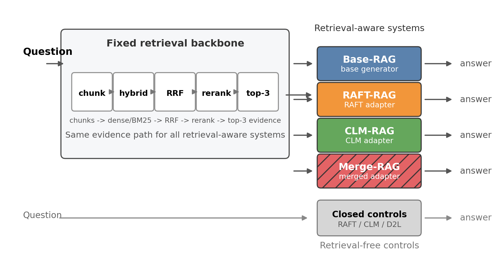
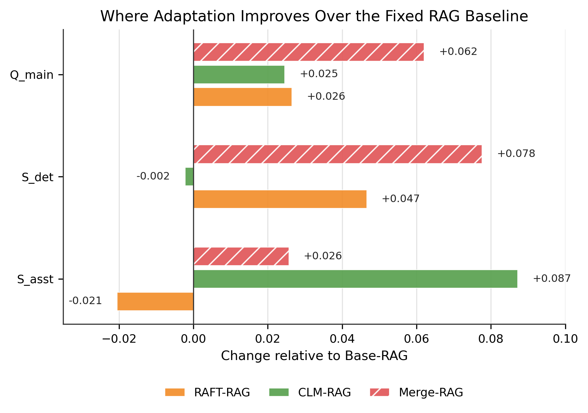
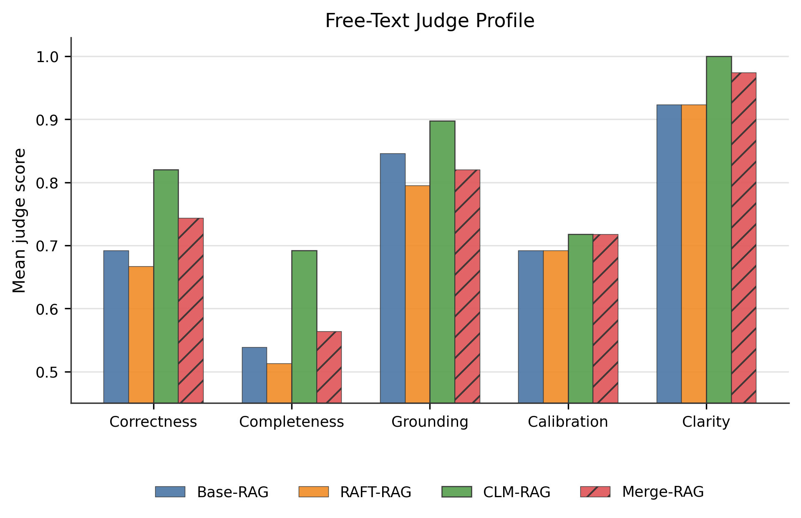
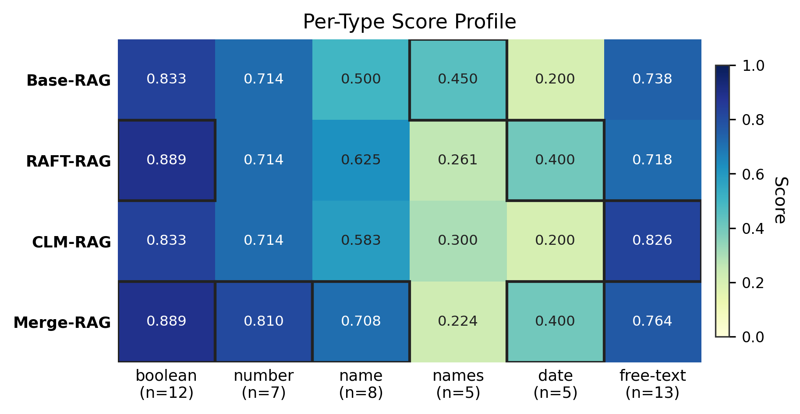
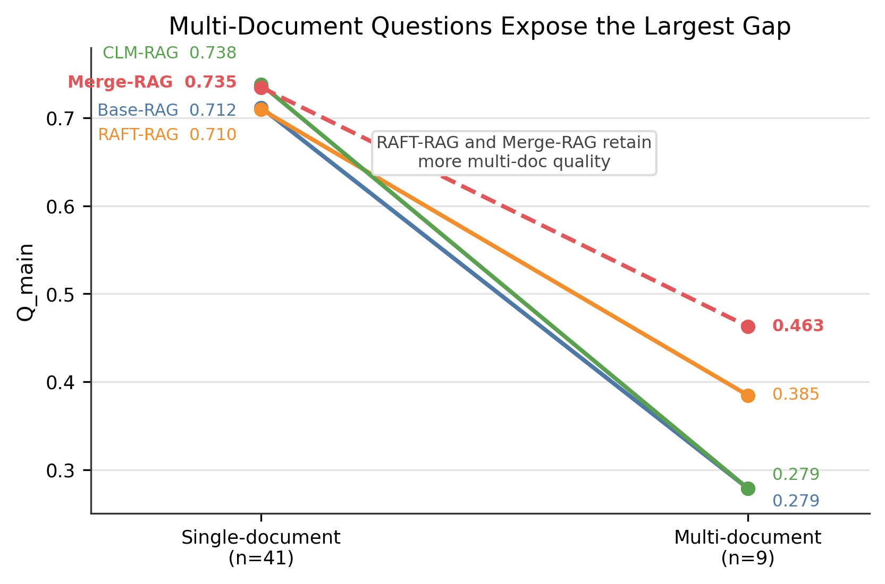
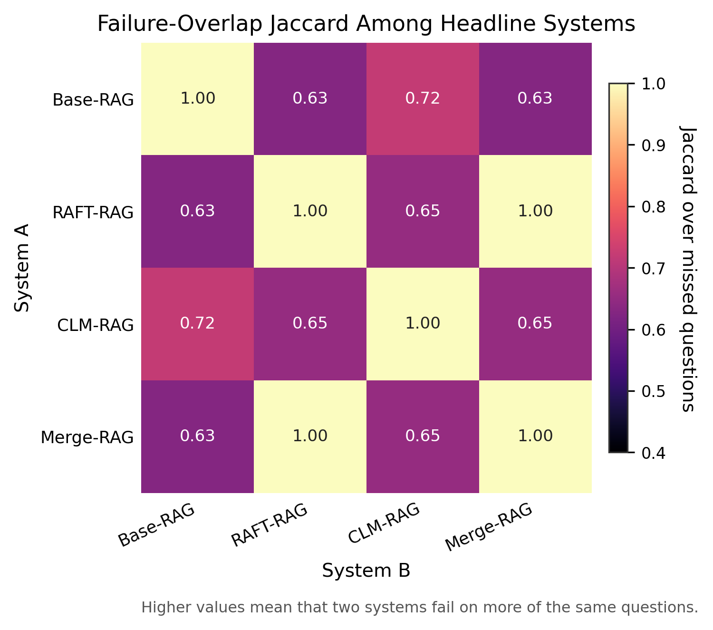
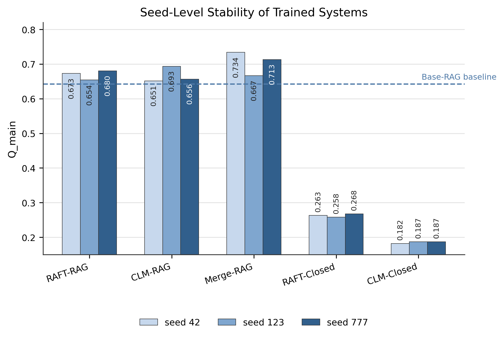
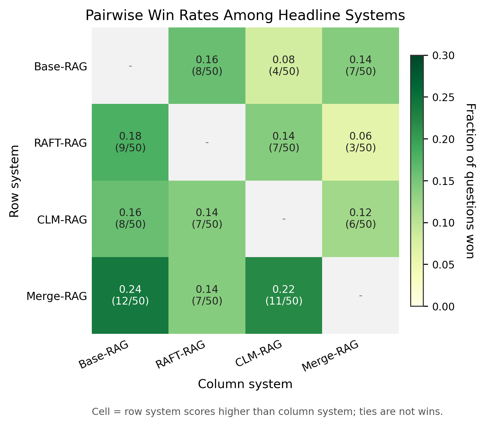

# Abstract

The value of parameter-efficient adaptation remains unclear when Retrieval-Augmented Generation (RAG) already supplies the source documents for document-grounded legal QA. RAFT-style supervised fine-tuning and Causal Language Modeling (CLM) continued pretraining are compared on the same frozen language model using a benchmark constructed from eight DIFC legal documents and a fixed retrieval configuration.

Closed-book controls remain weak, confirming the continued need for retrieved evidence in this setup. Within the retrieval-aware systems, RAFT improves deterministic extraction and multi-document composition. CLM improves free-text synthesis and explanation quality. A post-hoc adapter merge recovers the deterministic gain and yields the highest aggregate and multi-document scores. Its seed variance is higher, and CLM's free-text advantage is only partially retained. Under hardware constraints, the training signal should be selected for the required answer profile. Adapter fusion remains exploratory.

# Table of Contents

1. Introduction
2. Background and Related Work
3. Benchmark and Experimental Setup
4. Compared Systems and Evaluation Protocol
5. Results
6. Discussion and Limitations
7. Conclusion
- References
- Appendix A: Hyperparameters and Prompts
- Appendix B: Supplementary Tables and Figures
- Appendix C: Doc-to-LoRA Limitations in This Setup
- Appendix D: Use of Generative AI


## 1. Introduction

### 1.1 Problem and Motivation

Document-grounded legal question answering requires both factual precision and answer discipline. The target answer is frequently tied to a specific provision, date, list element, or procedural distinction, so unsupported generation is costly. Improvements should be credited when they strengthen document-bound answering under fixed evaluation conditions.

Resource limits make scaling to larger language models impractical in this setup and shift the design space toward retrieval engineering, smaller generators, and parameter-efficient adaptation. Practitioners then face a choice among investment in retrieval, generator adaptation, and their combination.

The central question is whether adapting the generator adds value once retrieval is already in place, and whether different adaptation signals produce different quality profiles under identical infrastructure constraints.

### 1.2 Research Questions and Scope

The evaluation is conducted with one legal benchmark, one frozen language model, one hardware configuration, and one fixed retrieval design. Two research questions are addressed.

**RQ1.** Does parametric adaptation yield gains over the RAG baseline on a compact legal benchmark under tight resource constraints, and how do RAFT-style supervised adaptation and supervision-free CLM continued pretraining differ as retrieval-conditioned generators?

**RQ2.** How far can pure parametric systems reach without retrieval on this benchmark, and does retrieval remain indispensable?

The findings apply to the evaluated benchmark and system configuration. Broader claims require an independent evaluation set, additional legal corpora, and other model families.

### 1.3 Contributions

Three empirical contributions are presented.

1. A comparison between RAFT-style supervised adaptation and CLM continued pretraining using the same language model, retrieval settings, and PEFT architecture.
2. A quantification of the limits of pure parametric memory by contrasting retrieval-aware systems against no-retrieval controls, thereby clarifying whether retrieval remains necessary in this setting.
3. A post-hoc adapter-merge result suggesting partial complementarity between the two training signals, reported as an exploratory finding that remains secondary to the headline comparison.

### 1.4 Structure of the Paper

The paper is organized to separate conceptual foundations, controlled system design, empirical evidence, and interpretation. Section 2 establishes the background on RAG, parameter-efficient adaptation, and the two training paradigms. Sections 3 and 4 then define the benchmark, hardware constraints, fixed retrieval configuration, compared systems, and evaluation protocol, ensuring that the results are interpreted against a common experimental basis. Section 5 presents the aggregate, per-type, and single-document versus multi-document results. Section 6 relates these findings to the research questions and examines common error patterns and limitations, while Section 7 derives practical implications and priorities for future work. This progression keeps methodological choices distinct from post-hoc interpretation and makes the conclusions traceable to the controlled comparisons.


## 2. Background and Related Work

### 2.1 RAG as Nonparametric Memory

Retrieval-augmented generation (RAG) supplies a generator with passages retrieved from an external corpus (Lewis et al., 2020). In legal QA, this supports page-level evidence tracing and gives a small model access to document content without requiring it to memorize the corpus. Parametric adaptation is evaluated here on top of the same hybrid retrieval, reranking, and evidence-compression setup, so gains are measured relative to an existing external-memory mechanism.

### 2.2 Parameter-Efficient Adaptation under Resource Constraints

Full fine-tuning stores optimizer states and gradients for every parameter, exceeding the available memory in this setting. Low-Rank Adaptation (LoRA) addresses this by freezing the pretrained weights and injecting small trainable rank-decomposition matrices into selected attention layers (Hu et al., 2022). QLoRA extends this approach by quantizing the frozen model to 4-bit NormalFloat (NF4) precision, reducing memory consumption further while preserving adaptation quality (Dettmers et al., 2023). Survey and review work describes this family of methods as a quality-versus-resource trade-off, as discussed by Han et al. (2024) and Xu et al. (2023).

QLoRA makes adaptation of the shared language model feasible within the available memory. The same QLoRA architecture is used for both adapted systems. Variation is introduced through their complete training recipes.

### 2.3 RAFT-style Adaptation vs. CLM Continued Pretraining

The central experimental axis contrasts two training signals applied to the same PEFT architecture.

**RAFT-style supervised adaptation.** Inspired by Retrieval-Augmented Fine-Tuning (Zhang et al., 2024), the adapter is trained on question-answer pairs where the input includes retrieved evidence chunks (both gold and distractor passages). This directly optimizes answer generation from evidence-rich contexts, exposing the adapter to the QA task distribution. Supervision is provided through the reference answers.

**CLM continued pretraining.** The adapter is trained on the raw corpus text using a standard causal language modeling (CLM) objective - next-token prediction on all tokens. No QA labels or task-specific formatting are used. The adapter is exposed to the corpus distribution without any task-specific supervision, relying solely on the language modeling objective to absorb domain patterns.

These two paradigms represent different assumptions about how parametric adaptation should interact with retrieval. RAFT-style training directly supervises answer production from retrieved evidence. CLM pretraining exposes the model to the corpus through next-token prediction. RAFT-style adaptation may favor deterministic extraction because its targets follow the QA task distribution. CLM adaptation may favor assistant-style answer quality because local contextualization is adjusted without task-specific labels. The empirical question is which of these tendencies becomes visible once both are tested against the same RAG baseline.

### 2.4 Research Gap and Positioning

Adjacent parts of the problem are addressed by existing work. General legal reasoning capabilities are evaluated by LegalBench (Guha et al., 2023). Retrieval precision is evaluated in LegalBench-RAG (Pipitone & Alami, 2024). Retrieval corpora, retrieval algorithms, rerankers, language models, and evaluation metrics are varied in LRAGE to measure whole-pipeline sensitivity (Park et al., 2025).

Retrieval-aware supervised fine-tuning is compared with base-model RAG and domain-specific supervised fine-tuning across non-legal benchmarks in the original RAFT study (Zhang et al., 2024). A matched corpus-level CLM condition is absent from that comparison. The resulting gap is addressed through a controlled comparison between RAFT-style supervision and corpus-level CLM under the same language model, PEFT architecture, retrieved evidence, and evaluation protocol. The conclusions are restricted to legal QA on the evaluated benchmark and resource-constrained hardware. Moderate gains are observed over the RAG baseline, and the quality profile depends on the selected training recipe.


## 3. Benchmark and Experimental Setup

### 3.1 Corpus and Benchmark

The benchmark is built on 8 PDF documents from the DIFC legal corpus, comprising statutes, regulations, and court judgments. Together, the documents span approximately 176 pages and 115,000 tokens. A pool of 200 question-answer pairs was authored by domain experts, covering six answer types. These comprise free-text explanations (53 questions), boolean lookups (48), numeric extractions (36), named entity lookups (30), multi-name lists (17), and date extractions (16). The distribution includes 26 multi-document comparative questions (13%) and 17 unanswerable questions (8.5%), ensuring that evaluation is not limited to simple single-document lookups. Difficulty labels span easy, medium, and hard cases.

The benchmark combines heterogeneous answer types, from boolean lookups to free-text legal explanations. This heterogeneity exposes distinct failure modes and prevents aggregate scores from masking type-specific weaknesses. The multi-document subset additionally provides a natural stress test for systems that may differ in local contextualization versus cross-document aggregation.

The 200 questions are split into 150 training questions and 50 evaluation questions, stratified by answer type, difficulty, and single-/multi-document status. The split was frozen before system comparison, and the same 50 questions are used for every evaluation. RAFT-style supervised adaptation uses only the 150 training questions. CLM continued pretraining uses the raw document text and is independent of the QA split. Reallocating existing questions to evaluation would change the RAFT training set and define a different experiment. Stronger validation therefore requires a new independently constructed question set and a complete rerun of every system and seed.

### 3.2 Hardware, Shared Model, and Variance Policy

All experiments are run on a single NVIDIA RTX 4060 with 8 GB VRAM and 32 GB system RAM. Gemma-2-2b-it, an instruction-tuned model with approximately 2 billion parameters, is used as the shared language model and is held constant across all systems. Model architecture and deployment environment are therefore controlled in the training-recipe comparison.

For systems that involve training (RAFT-RAG, CLM-RAG, and their no-retrieval controls), three random seeds (42, 123, 777) are used, and results are reported as mean +/- standard deviation. No cross-validation is performed. The single frozen split is shared across all evaluations, and seed-level variance captures only the stochasticity introduced by the training process. Reporting three seeds provides an initial view of training stability. Sampling uncertainty over questions is not estimated by this procedure.

### 3.3 Fixed Retrieval Configuration

The retrieval configuration is held constant across all retrieval-aware systems (Base-RAG, RAFT-RAG, CLM-RAG, Merge-RAG). Five stages are included in the configuration.

1. **Ingestion and hierarchical chunking.** Documents are parsed and split into five chunk families comprising page-level, section-level, clause-level, microchunks (300 tokens, 50-token overlap), and table blocks. Metadata - including entities, dates, heading paths, and BM25 terms - is extracted for each chunk.

2. **Hybrid retrieval.** Each query is embedded using Qwen3-Embedding-0.6B (384 dimensions) for dense retrieval and tokenized for BM25 sparse retrieval (k1 = 1.5, b = 0.75). Both channels prefetch 30 candidates.

3. **Reciprocal Rank Fusion (RRF).** Dense and sparse candidate lists are fused with equal weights and k = 60, producing a ranked list of 10 candidates.

4. **Cross-encoder reranking.** The top 10 candidates are reranked using Qwen3-Reranker-0.6B, and the top 5 are retained.

5. **Evidence compression.** A page-diverse compressor selects up to 3 chunks (at most one per physical page), and the corresponding (doc\_id, page\_number) pairs are lifted for grounding evaluation.

System differences are therefore interpreted at the generator stage. Exact retrieval parameters are listed in Appendix A.


## 4. Compared Systems and Evaluation Protocol

### 4.1 System Inventory

Seven systems occupy distinct methodological roles. Three form the headline comparison, one provides an exploratory post-hoc result, and three serve as negative controls. Table 1 summarizes their key characteristics.

**Table 1. Compared systems and their roles.**

| System | Retrieval | Training signal | Supervision | Role |
|--------|-----------|-----------------|-------------|------|
| Base-RAG | Yes | None | --- | Headline baseline |
| RAFT-RAG | Yes | RAFT-style QA | Supervised | Headline |
| CLM-RAG | Yes | CLM on corpus | Unsupervised | Headline |
| Merge-RAG | Yes | Merged RAFT + CLM | Post-hoc | Exploratory |
| RAFT-Closed | No | RAFT-style QA | Supervised | Control |
| CLM-Closed | No | CLM on corpus | Unsupervised | Control |
| D2L-Closed | No | D2L hypernetwork | Supervised | Control |



*Figure 1. System overview schematic. Base-RAG routes queries through the shared retrieval configuration to the base generator. RAFT-RAG and CLM-RAG route retrieved evidence to an adapted generator. Merge-RAG uses a merged adapter. The controls bypass retrieval entirely.*

**Base-RAG** serves as the nonparametric baseline. The frozen Gemma-2-2b-it generator receives retrieved evidence and produces answers without any adapter.

**RAFT-RAG** and **CLM-RAG** are the two headline adapted systems. Both receive the same retrieved evidence as the baseline and use the same QLoRA architecture (rank 32, alpha 32, dropout 0.05, targeting q\_proj and v\_proj). Separate training recipes are used. RAFT-RAG is trained on question-answer pairs with retrieved context. CLM-RAG is trained on raw corpus text through causal language modeling. These three systems define the main thesis comparison.

**Merge-RAG** (Post-hoc adapter fusion) linearly interpolates the RAFT-RAG and CLM-RAG adapters with equal weights (alpha = 0.5), pairing source adapters by matching training seed, without any additional training, and receives the same retrieved evidence. Merge-RAG inherits the prior training effort of both source adapters and is reported outside the headline branch as an exploratory result.

**RAFT-Closed** is trained separately on question-answer pairs without retrieved context. **CLM-Closed** reuses the CLM-RAG adapter and bypasses retrieval at inference time. These controls clarify the limits of parametric memory without retrieval and are not part of the main claim. **D2L-Closed** is a secondary feasibility control using a Doc-to-LoRA hypernetwork approach (Charakorn et al., 2026). The released implementation imposes a per-adapter token limit, while adaptation to the modern target model would require a bespoke hypernetwork that was not trained here. D2L-Closed therefore characterizes the released method under the evaluated resource and compatibility constraints; implementation details are reported in Appendix C.

### 4.2 Training Setups

Both RAFT-RAG and CLM-RAG employ identical QLoRA architectures applied to the same frozen model. Their complete training recipes differ in objective, data, learning rate, epoch count, and maximum sequence length. The two complete recipes are therefore evaluated. An isolated effect of the training objective cannot be estimated from this design.

**RAFT-RAG training.** The adapter is fine-tuned for 3 epochs on the 150 training questions in RAFT format. Each training example consists of the question, gold evidence chunks (matched to gold retrieval pages), and 2 distractor chunks from unrelated documents. The target is the reference answer. Learning rate is 2 x 10^-4 with cosine decay and 3% warmup. Maximum sequence length is 4096 tokens.

**CLM-RAG training.** The adapter is pretrained for 5 epochs on the concatenated corpus text (~115K tokens) using a CLM objective. Learning rate is 5 x 10^-5 with cosine decay and 10% warmup. Maximum sequence length is limited to 512 tokens because longer sequences exceed the available memory at the logits stage. The same adapter is reused without retrieval as the CLM-Closed control.

**RAFT-Closed control training.** The closed-book supervised control is intentionally matched to RAFT-RAG in optimizer and PEFT settings (learning rate 2 x 10^-4, cosine schedule, 3% warmup, 3 epochs, maximum sequence length 4096). Only the training data format differs. Retrieved context is omitted, and question-to-answer pairs are used alone.

**Merge-RAG.** No training is performed. The RAFT-RAG and CLM-RAG adapter weight matrices are linearly interpolated per matching seed pair (42, 123, 777), with W\_merged = 0.5 * W\_RAFT-RAG + 0.5 * W\_CLM-RAG.

### 4.3 Evaluation Protocol

The evaluation protocol combines deterministic scoring for structured answer types with judge-based assessment for free-text responses, alongside grounding and operational metrics.

**Composite metric.** The primary metric is Q\_main = 0.7 * S\_det + 0.3 * S\_asst, weighting deterministic extraction at 0.7 and judged free-text quality at 0.3. This weighting prioritizes factual precision while still crediting assistant-style quality on free-text answers.

**Deterministic score (S\_det).** For boolean and date questions, scoring is binary exact match after normalization. Numeric answers are scored with exact match under a 1% tolerance. Single-name answers use normalized exact string match. Multi-name lists are scored as the Jaccard similarity between predicted and gold name sets.

**Unanswerable items.** Unanswerable questions are handled differently depending on answer type. For deterministic unanswerable questions, the gold answer is null and the expected system output is the empty list `[]`. A system receives 1.0 only when it returns `[]` and 0.0 otherwise. Free-text unanswerable questions remain part of the judged free-text subset and are excluded from S\_det. They are scored through the same judge procedure as other free-text answers, with the calibration criterion rewarding an explicit statement that the requested information is absent or unsupported.

**Free-text score (S\_asst).** Free-text responses are evaluated by GPT-5.4-mini (OpenAI, model id `gpt-5.4-mini`, reasoning effort = medium), held fixed across all systems and experiments. Five binary criteria are applied, covering correctness, completeness, grounding, calibration, and clarity. This procedure follows the LLM-as-judge paradigm discussed for legal RAG evaluation by Pradhan et al. (2025). The per-question score is the mean of the 5 criteria. S\_asst is the mean across all free-text questions. The judge prompt is frozen and identical for all systems (Appendix A.5). Malformed judge output is retried once. If the retry also fails, all five criteria are scored as zero for that answer. Before final interpretation, a manual audit of approximately 10% of judged free-text responses was performed, spot-checking judge scores against the rubric for systematic errors. Judge-based scoring is never used for deterministic answer types.

**Grounding (G).** For retrieval-aware systems, grounding is computed as F\_beta (beta = 2.5) on page-level (doc\_id, page\_number) pairs, comparing the final evidence set against gold retrieval references. The elevated beta emphasizes recall, penalizing missing gold pages more than including extra pages. Because retrieval is fixed, grounding serves as a control on evidence access. The constant G = 0.567 confirms identical page-level evidence coverage across the retrieval-aware systems. Adapter effects are therefore evaluated through changes in evidence-conditioned generation.

**Operational metrics.** Latency (time-to-first-token and end-to-end), peak inference VRAM, offline training cost, and malformed output rate are reported for all systems. The full breakdown is given in Appendix B.3, and Table 2 summarizes the headline figures. Quality and resource expenditure are interpreted together, with direct offline-cost comparison restricted to systems that are genuinely comparable in training or packaging effort.

\clearpage

## 5. Results

### 5.1 Main Comparison

Table 2 presents the aggregate results across all systems. The headline systems are grouped at the top, followed by the exploratory post-hoc merge, and then the negative controls.

**Table 2. Main results on the 50-question evaluation set.** Trained systems report mean +/- std across 3 seeds. Offline cost is per-seed wall-clock training time. Merge-RAG is excluded from direct offline-cost comparison because it inherits prior adaptation cost from both source adapters.

| | Q\_main | S\_det | S\_asst | G | Latency (ms) | VRAM (MB) | Offline (s) |
|---|---------|--------|---------|------|--------------|-----------|------------|
| **Headline** | | | | | | | |
| Base-RAG | 0.643 | 0.601 | 0.739 | 0.567 | 479 | 5201 | --- |
| RAFT-RAG | 0.669 +/- 0.014 | 0.648 +/- 0.015 | 0.718 +/- 0.018 | 0.567 | 492 | 3069 | 1206 |
| CLM-RAG | 0.667 +/- 0.023 | 0.599 +/- 0.016 | 0.826 +/- 0.062 | 0.567 | 525 | 3069 | 581 |
| **Post-hoc** | | | | | | | |
| Merge-RAG | 0.705 +/- 0.035 | 0.679 +/- 0.048 | 0.764 +/- 0.018 | 0.567 | 527 | 3069 | n.c.* |
| **Controls** | | | | | | | |
| RAFT-Closed | 0.263 +/- 0.005 | 0.270 | 0.246 | --- | 257 | 3067 | 88 |
| CLM-Closed | 0.185 +/- 0.003 | 0.135 | 0.303 | --- | 195 | 3077 | 581 |
| D2L-Closed | 0.210 | 0.135 | 0.385 | --- | 179 | 3072 | 3932 |

\* Not directly comparable. Merge-RAG inherits the combined offline cost of RAFT-RAG (1206 s) and CLM-RAG (581 s). The merge itself is instantaneous.

The RAG baseline (Base-RAG) reaches Q\_main = 0.643, establishing a difficult starting point for any adapted retrieval-aware system. Both retrieval-aware adapters improve on it. RAFT-RAG attains 0.669 +/- 0.014, and CLM-RAG attains 0.667 +/- 0.023. The observed improvements are moderate (+0.026 for RAFT-RAG and +0.025 for CLM-RAG) and consistent across seeds. No paired significance test or confidence interval over the 50 evaluation questions is reported. These values therefore describe observed differences and do not establish statistical gains. The gains are small and measured with fixed evidence selection.

Merge-RAG reaches the highest observed score (0.705 +/- 0.035) through post-hoc adapter interpolation. Its higher seed variance (std = 0.035 vs. 0.014 and 0.023 for the headline adapters) and post-hoc nature warrant cautious interpretation. Partial complementarity between the two adaptation signals is suggested. The predefined headline comparison remains primary.



*Figure 2. Improvement over Base-RAG. Grouped bars show Delta-Q\_main, Delta-S\_det, and Delta-S\_asst for RAFT-RAG, CLM-RAG, and Merge-RAG. RAFT raises S\_det, CLM raises S\_asst, and the merge raises both.*

### 5.2 Trade-off Between RAFT-RAG and CLM-RAG

The two headline systems are near-tied on aggregate Q\_main and improve different quality dimensions. This distinction is central to the analysis.

RAFT-RAG achieves higher deterministic extraction scores (S\_det = 0.648 vs. 0.599), reflecting its supervised exposure to question-answer pairs with evidence context. CLM-RAG achieves higher observed free-text answer quality (S\_asst = 0.826 vs. 0.718), suggesting that CLM pretraining improves the generator's ability to produce well-structured legal explanations. On the aggregate Q\_main, the two systems are near-tied (delta = 0.002), with RAFT-RAG marginally ahead. The difference is too small to support a claim of practical dominance.

Relative to the RAG baseline, RAFT-RAG improves Q\_main by +0.026 and S\_det by +0.047 while slightly reducing S\_asst by -0.021. CLM-RAG improves Q\_main by +0.025 and S\_asst by +0.087 while leaving S\_det essentially unchanged (-0.002). This pattern supports the interpretation that training signal matters more than the mere presence of an adapter.

The comparison thus records a tie on Q\_main and grounding, with RAFT-RAG favored on deterministic extraction and CLM-RAG favored on assistant-style quality and offline cost.



*Figure 3. Judge criteria profile comparing Base-RAG, RAFT-RAG, CLM-RAG, and Merge-RAG on the 5 judge criteria (correctness, completeness, grounding, calibration, clarity). CLM-RAG's advantage is concentrated in free-text quality dimensions.*

### 5.3 By Answer Type

Type-level analysis reveals that performance differences between systems are concentrated in specific answer categories. Table 3 presents per-type scores for the six answer types. Each cell reports the metric defined for that type.

\Needspace{14\baselineskip}

**Table 3. Per-type scores on the 50-question evaluation set.** Each cell reports S\_det for the deterministic types (boolean, number, name, names, date) or S\_asst for free-text. Only headline and exploratory systems are shown. Control systems are reported in Appendix B.

| | Boolean (n=12) | Number (n=7) | Name (n=8) | Names (n=5) | Date (n=5) | Free-text (n=13) |
|---|----------------|-------------|------------|-------------|------------|-------------------|
| Base-RAG | 0.833 | 0.714 | 0.500 | 0.450 | 0.200 | 0.739 |
| RAFT-RAG | 0.889 | 0.714 | 0.625 | 0.261 | 0.400 | 0.718 |
| CLM-RAG | 0.833 | 0.714 | 0.583 | 0.300 | 0.200 | 0.826 |
| Merge-RAG | 0.889 | 0.810 | 0.708 | 0.224 | 0.400 | 0.764 |

The largest divergences appear between deterministic extraction and free-text explanation. RAFT-RAG outperforms the RAG baseline on boolean (+0.056), name (+0.125), and date (+0.200) types, consistent with its supervised training on structured answer extraction. CLM-RAG shows its advantage primarily on free-text (+0.087 relative to the baseline), where judged quality benefits from the CLM adapter's exposure to corpus-level language patterns.

The breakdown also shows that no system performs uniformly well. The multi-name category remains difficult for the adapted systems, with both RAFT-RAG (0.261) and CLM-RAG (0.300) underperforming the RAG baseline (0.450). Date extraction remains weak across all systems. Even the best system achieves only 0.400 on dates (n=5). These results point to persistent formatting and evidence-utilization limitations that neither training signal fully addresses. The main interpretive point is that near-equal aggregate scores conceal distinct answer behaviors that align with the different adaptation signals.

Merge-RAG achieves the highest score in 4 of 6 types, including number (0.810) and name (0.708), providing further evidence that the two training signals are partially complementary, though this observation remains secondary given the system's post-hoc nature.



*Figure 4. Per-type score heatmap for Base-RAG, RAFT-RAG, CLM-RAG, and Merge-RAG across the 6 answer types, with sample sizes in labels.*

### 5.4 Retrieval Contribution and the Limits of Pure Parametric Memory

Removing retrieval lowers quality for both adaptation paradigms. Q\_main drops from 0.669 to 0.263 for RAFT (RAFT-RAG to RAFT-Closed, a gap of 0.406) and from 0.667 to 0.185 for CLM (CLM-RAG to CLM-Closed, a gap of 0.482). This pattern holds across both S\_det and S\_asst. For the CLM system, S\_det drops from 0.599 to 0.135 and S\_asst from 0.826 to 0.303. These gaps show that retrieval remains necessary for these adapted generators in this setting.

The D2L control (D2L-Closed) supports the same conclusion through a distinct adapter-generation approach. It reaches Q\_main = 0.210, between RAFT-Closed at 0.263 and CLM-Closed at 0.185, and below every retrieval-aware system. Its S\_asst = 0.385 suggests that the hypernetwork-generated adapter retains some corpus-level language patterns. This remains insufficient for factual legal QA without evidence retrieval. Because the released D2L implementation required chunk-level adaptation and adapter merging, the result applies to this resource-constrained implementation.

These results indicate that retrieval remains the dominant memory mechanism in this setting. Parametric adaptation without evidence access is insufficient, regardless of whether the adapter was trained with supervised QA labels (RAFT-Closed) or corpus-level language modeling (CLM-Closed).

\Needspace{18\baselineskip}

### 5.5 Single-Document vs. Multi-Document Difficulty

Multi-document questions score lower than single-document questions across all systems. Table 4 presents the document-scope breakdown.

**Table 4. Q\_main by document scope (headline and exploratory systems).** Based on 42 single-document and 8 multi-document evaluation questions.

| | Single-doc | Multi-doc | Delta |
|---|-----------|-----------|-------|
| Base-RAG | 0.696 | 0.310 | -0.386 |
| RAFT-RAG | 0.694 | 0.437 | -0.257 |
| CLM-RAG | 0.722 | 0.310 | -0.412 |
| Merge-RAG | 0.718 | 0.523 | -0.195 |

The RAG baseline and CLM-RAG both reach Q\_main = 0.310 on multi-document items. RAFT-RAG reaches 0.437, and Merge-RAG reaches 0.523. This breakdown reveals a sharper behavioral distinction than the aggregate table alone.

On single-document questions, CLM-RAG has the highest observed mean at 0.722, narrowly above Merge-RAG at 0.718. Given the 0.004 difference, overlapping seed-level variation, and absence of a paired significance test, this result does not establish a meaningful CLM-RAG advantage. On multi-document questions, CLM-RAG and the RAG baseline both score 0.310. No cross-document aggregation gain is observed for CLM-RAG.

RAFT-style supervision confers greater robustness to multi-document composition. RAFT-RAG's multi-doc score (0.437) represents a 41% relative improvement over the baseline's 0.310. The RAFT training format, which includes distractors alongside gold chunks, may teach the generator to discriminate between relevant and irrelevant evidence when evidence spans multiple documents.



*Figure 5. Single-document vs. multi-document Q\_main per system, annotated with per-system delta.*

### 5.6 Exploratory Adapter Fusion

The merged adapter Merge-RAG provides evidence of partial complementarity between the two adaptation signals. Relative to RAFT-RAG, Merge-RAG improves Q\_main by +0.036, S\_det by +0.031, and S\_asst by +0.046. Relative to CLM-RAG, it improves Q\_main by +0.037 and S\_det by +0.080, with an S\_asst change of -0.062. In the document-scope breakdown, Merge-RAG reaches 0.718 on single-document questions, just below CLM-RAG at 0.722, and the highest multi-document score at 0.523. It also has the smallest single-to-multi-document gap (delta = -0.195 vs. -0.386 for the RAG baseline). The merged system preserves part of the CLM advantage in assistant-style quality and recovers most of the deterministic advantage associated with RAFT-style supervision.

The result is methodologically consistent with recent work on LoRA adapter composition. Prabhakar et al. (2024) show that adapter merge schemes can approach multi-task training quality without retraining, and more structured alternatives such as rank-wise clustering (Zhao et al., 2024) suggest further room for improvement. The current experiment uses a simple linear merge.

The result remains post-hoc for two reasons. First, Merge-RAG was constructed from separately trained adapters after the main experiments. Its advantage carries higher seed variance (std = 0.035, with per-seed Q\_main values of 0.734 / 0.667 / 0.713), the widest spread among the trained retrieval-aware systems. Second, its practical cost is not directly comparable to the headline systems because it inherits prior adaptation cost from both source adapters. The merged system is therefore retained for interpretation and excluded from practical system selection. Its post-hoc status limits the result to evidence of signal complementarity and does not establish a general recipe.

\clearpage


## 6. Discussion and Limitations

### 6.1 Answer to RQ1

RQ1 asked whether parametric adaptation yields gains over the RAG baseline and how RAFT-style and CLM adaptation differ. The answer is a qualified affirmative.

Both RAFT-RAG and CLM-RAG improve over the nonparametric RAG baseline. The observed gains are moderate (+0.026 and +0.025 Q\_main respectively) and are not accompanied by a paired significance test or confidence interval over the 50 evaluation questions. They show that adaptation can affect answer quality after retrieval has been established. Their magnitude does not establish a qualitative change in the task.

The training signal determines the observed quality profile. RAFT-style supervision improves deterministic extraction (S\_det = +0.047 over the baseline), with a slight decrease in free-text quality (S\_asst = -0.021). CLM continued pretraining improves free-text answer quality (S\_asst = +0.087), with essentially unchanged deterministic extraction (S\_det = -0.002). Factual precision therefore favors RAFT-RAG. Explanation quality and lower offline cost favor CLM-RAG, which takes roughly half as long to train.

The post-hoc merge Merge-RAG achieves the highest aggregate score (0.705), suggesting that the two signals are partially complementary. Merge-RAG was identified after the headline experiments and was not retrained.

### 6.2 Answer to RQ2

RQ2 asked whether pure parametric systems can substitute for retrieval. The answer is negative within the present setup. Retrieval remains necessary.

Neither supervised closed-book adaptation (RAFT-Closed, Q\_main = 0.263) nor corpus-level CLM pretraining without retrieval (CLM-Closed, Q\_main = 0.185) provides a viable substitute for external evidence retrieval. The D2L control (Q\_main = 0.210) corroborates this from a third direction. Under this setup, the 2-billion-parameter model did not internalize enough factual detail to answer legal questions without external evidence.

Within the evaluated corpus, split, model, and hardware regime, retrieval remains the main carrier of document knowledge. Parametric adaptation affects how retrieved evidence is used.

### 6.3 Error Analysis

Error overlap analysis clarifies both the shared difficulty of the benchmark and the limits of any single system improvement. Fifteen of the 50 evaluation questions are missed by all headline systems (Base-RAG, RAFT-RAG, CLM-RAG, and Merge-RAG). The mean pairwise Jaccard overlap of their failure sets is 0.714, showing that the systems share many errors without identifying whether those errors originate in retrieval coverage, question ambiguity, or generation.

Persistent failure patterns include date extraction (scores at or below 0.400 for all systems), multi-name list normalization (at or below 0.450), and cross-document composition. Among the 15 universally missed questions, recurring themes include unanswerable questions where the gold answer is null, questions requiring information from document regions not well covered by the 3-chunk evidence budget, and questions demanding multi-step cross-document reasoning. Several of these errors persist even when retrieval succeeds. Some failures therefore reflect remaining difficulty in mapping retrieved context to precise answer behavior.

Local wins by individual systems are sparse. Two questions are answered correctly only by Base-RAG, two only by CLM-RAG, and none only by RAFT-RAG or Merge-RAG. The systems have different aggregate profiles, but their per-question advantages rarely translate into exclusive wins. This is consistent with the modest aggregate deltas observed in Section 5.1.

### 6.4 Limitations

The following limitations apply.

- **Compact corpus and single legal setting.** The benchmark comprises 8 documents (~115K tokens) from the DIFC legal corpus. Transfer to larger corpora, other jurisdictions, and unseen document collections is not measured.
- **Evaluation scope and single split.** The fixed evaluation split contains 50 questions; the multi-name and date categories contain 5 items each, and the multi-document subset contains 8. The three seeds quantify training stochasticity but do not quantify sampling uncertainty over questions. No cross-validation, paired significance test, or confidence interval over questions is reported. Reallocating questions from the existing pool would change the RAFT training set and define a new experiment. Broader validation requires an independent question set and a complete rerun of every system and seed.
- **Single model and hardware configuration.** All experiments use Gemma-2-2b-it on one RTX 4060. Different model families, scales, and memory budgets may change both the quality profile and relative training cost of the adaptation methods.
- **Training-recipe confounding.** RAFT and CLM differ in objective, data, learning rate, epoch count, and maximum sequence length. The reported comparison covers the complete adaptation recipes. An isolated causal effect of the objective cannot be estimated.
- **Fixed retrieval.** The evaluation measures differences in evidence-conditioned generation under one frozen retrieval configuration. Interactions between generator adaptation and retrieval quality remain unmeasured, as do results under alternative retrieval designs.
- **Judge-based free-text scoring.** S\_asst depends on a frozen rubric evaluated by GPT-5.4-mini and may contain systematic judge bias. The manual audit covers approximately 10% of judged responses and cannot exclude smaller or category-specific biases.
- **Post-hoc adapter fusion.** Merge-RAG was introduced after the headline experiments and inherits the prior adaptation cost of both source adapters. Its result requires confirmation with a pre-specified merge procedure, a separate validation set for merge selection, and additional seeds.
- **D2L implementation scope.** The released hypernetwork's per-adapter token limit required splitting the corpus into 108 chunks and merging the resulting adapters. This differs from document-level conditioning, and no bespoke hypernetwork was trained for the modern target model.


## 7. Conclusion

Generator-side adaptation was evaluated after a fixed retrieval configuration had been established. Distinct answer profiles were produced by the RAFT and CLM training recipes under identical evidence access. Four hypotheses are suggested by these profiles.

**RAFT-style supervision appears to specialize the generator for controlled extraction and evidence composition.** RAFT-RAG improves S\_det by +0.047 over the RAG baseline and reaches 0.437 on multi-document questions, compared with 0.310 for the baseline. Its S\_asst decreases by 0.021. This pattern supports the hypothesis that direct QA supervision with gold and distractor passages strengthens evidence discrimination and target-conforming answer production. The responsible RAFT components cannot be isolated from the current experiment. Distractor exposure, multi-document training examples, and the balance between deterministic and free-text targets should be ablated separately.

**CLM continued pretraining appears to improve domain-conditioned explanation quality.** CLM-RAG produces the highest free-text score, with S\_asst = 0.826 and a gain of +0.087 over the baseline. Its offline training time is approximately half that of RAFT-RAG. No gain is observed on the eight multi-document questions. These results support the hypothesis that next-token training on corpus text improves domain-specific expression and local contextualization without directly teaching cross-document evidence selection. This hypothesis can be tested through cross-document CLM sequences, auxiliary evidence-selection objectives, and mixed CLM-plus-QA training.

**Adapter fusion suggests partial compatibility between the learned updates.** Merge-RAG reaches the highest observed aggregate score (0.705) and multi-document score (0.523), while retaining part of the CLM free-text gain. Its post-hoc construction and higher seed variance prevent a prescriptive conclusion. Validation-selected merge weights, rank-wise composition, learned adapter routing, and joint multi-objective training should be compared under a pre-specified protocol.

**Scalable composition is a testable requirement for D2L-style document internalization in this setup.** The D2L experiment required 108 chunk-level adapters because full documents exceeded the effective per-adapter limit. This result motivates hierarchical adapter composition, document-level routing, and hypernetworks trained for the target model and context scale. These directions concern generator-side knowledge integration and can be evaluated without changing the RAG retriever.

The closed-book controls remain below Q\_main = 0.27, so external evidence remains necessary in this setup. This result defines the operating boundary for the generator-side methods. The next evaluation should use a larger independent holdout, multiple model families, and factorial controls that separate training data, objective, and schedule. The highest-priority tests are the RAFT component ablations, mixed CLM-plus-QA training, and pre-specified adapter composition.


## References

- Charakorn, R., Cetin, E., Uesaka, S., & Lange, R. T. (2026). Doc-to-LoRA: Learning to instantly internalize contexts. *arXiv preprint arXiv:2602.15902*. https://arxiv.org/abs/2602.15902

- Dettmers, T., Pagnoni, A., Holtzman, A., & Zettlemoyer, L. (2023). QLoRA: Efficient finetuning of quantized LLMs. *Advances in Neural Information Processing Systems, 36*. https://arxiv.org/abs/2305.14314

- Guha, N., Nyarko, J., Ho, D. E., Re, C., Chilton, A., Narayana, A., & others. (2023). LegalBench: A collaboratively built benchmark for measuring legal reasoning in large language models. *arXiv preprint arXiv:2308.11462*. https://arxiv.org/abs/2308.11462

- Han, Z., Gao, C., Liu, J., Zhang, J., & Zhang, S. Q. (2024). Parameter-efficient fine-tuning for large models: A comprehensive survey. *arXiv preprint arXiv:2403.14608*. https://arxiv.org/abs/2403.14608

- Hu, E. J., Shen, Y., Wallis, P., Allen-Zhu, Z., Li, Y., Wang, S., Wang, L., & Chen, W. (2022). LoRA: Low-rank adaptation of large language models. *Proceedings of ICLR 2022*. https://arxiv.org/abs/2106.09685

- Lewis, P., Perez, E., Piktus, A., Petroni, F., Karpukhin, V., Goyal, N., Kuttler, H., Lewis, M., Yih, W., Rocktaschel, T., Riedel, S., & Kiela, D. (2020). Retrieval-augmented generation for knowledge-intensive NLP tasks. *Advances in Neural Information Processing Systems, 33*, 9459--9474. https://arxiv.org/abs/2005.11401

- Park, M., Oh, H., Choi, E., & Hwang, W. (2025). LRAGE: Legal retrieval augmented generation evaluation tool. *arXiv preprint arXiv:2504.01840*. https://arxiv.org/abs/2504.01840

- Pipitone, N., & Alami, G. H. (2024). LegalBench-RAG: A benchmark for retrieval-augmented generation in the legal domain. *arXiv preprint arXiv:2408.10343*. https://arxiv.org/abs/2408.10343

- Prabhakar, A., Li, Y., Narasimhan, K., Kakade, S., Malach, E., & Jelassi, S. (2024). LoRA Soups: Merging LoRAs for practical skill composition tasks. *arXiv preprint arXiv:2410.13025*. https://arxiv.org/abs/2410.13025

- Pradhan, A., Ortan, A., Verma, A., & Seshadri, M. (2025). LLM-as-a-Judge: Rapid evaluation of legal document recommendation for retrieval-augmented generation. *arXiv preprint arXiv:2509.12382*. https://arxiv.org/abs/2509.12382

- Xu, L., Xie, H., Qin, S.-Z. J., Tao, X., & Wang, F. L. (2023). Parameter-efficient fine-tuning methods for pretrained language models: A critical review and assessment. *arXiv preprint arXiv:2312.12148*. https://arxiv.org/abs/2312.12148

- Zhang, T., Patil, S. G., Jain, N., Shen, S., Zaharia, M., Stoica, I., & Gonzalez, J. E. (2024). RAFT: Adapting language model to domain specific RAG. *arXiv preprint arXiv:2403.10131*. https://arxiv.org/abs/2403.10131

- Zhao, Z., Shen, T., Zhu, D., Li, Z., Su, J., Wang, X., Kuang, K., & Wu, F. (2024). Merging LoRAs like playing LEGO: Pushing the modularity of LoRA to extremes through rank-wise clustering. *arXiv preprint arXiv:2409.16167*. https://arxiv.org/abs/2409.16167


## Appendix A. Hyperparameters and Prompts

### A.1 QLoRA Configuration (Shared)

| Parameter      | Value                          |
| -------------- | ------------------------------ |
| PEFT method    | QLoRA                          |
| Rank           | 32                             |
| Alpha          | 32                             |
| Dropout        | 0.05                           |
| Target modules | q\_proj, v\_proj               |
| Quantization   | 4-bit NF4, double quantization |
| Optimizer      | Paged AdamW 8-bit              |
| Scheduler      | Cosine                         |
| Weight decay   | 0.01                           |

### A.2 Training-Signal-Specific Parameters

| Parameter | RAFT-RAG | RAFT-Closed (closed-book) | CLM-Closed / CLM-RAG (CLM) |
|-----------|-------------|------------------|------------------|
| Learning rate | 2 x 10^-4 | 2 x 10^-4 | 5 x 10^-5 |
| Epochs | 3 | 3 | 5 |
| Warmup ratio | 0.03 | 0.03 | 0.10 |
| Max seq. length | 4096 | 4096 | 512 |
| Effective batch size | 4 | 4 (micro-batch 1, grad. accum. 4) | 4 (micro-batch 1, grad. accum. 4) |
| Training data | 150 QA pairs (RAFT format) | 150 QA pairs (no context) | ~115K tokens (raw corpus) |
| Supervision | Supervised (question + evidence -> answer) | Supervised (question -> answer) | Unsupervised (next-token) |

RAFT-Closed differs from RAFT-RAG only in training data format. Retrieved context is omitted. The CLM-Closed/CLM-RAG adapter is trained once via CLM and reused either without retrieval (CLM-Closed) or with retrieval (CLM-RAG). The CLM maximum sequence length of 512 is imposed by available memory. CLM computes loss over all tokens, and longer sequences exceeded the memory budget at the logits stage.

### A.3 Retrieval Parameters

| Parameter | Value |
|-----------|-------|
| Embedding model | Qwen3-Embedding-0.6B (384-dim) |
| Sparse encoder | BM25 Okapi (k1=1.5, b=0.75) |
| Chunk size (microchunk) | 300 tokens |
| Chunk overlap | 50 tokens |
| Chunk families | page, section, clause, microchunk, table |
| Candidate prefetch | 30 (per channel) |
| RRF k | 60 |
| RRF weights | dense=1.0, sparse=1.0 |
| Post-fusion candidates | 10 |
| Reranker | Qwen3-Reranker-0.6B |
| Rerank budget | 5 |
| Evidence budget | 3 |
| Max chunks per page | 1 (page-diverse) |

### A.4 Generation Parameters

| Parameter | Value |
|-----------|-------|
| Model | Gemma-2-2b-it |
| Temperature | 0.0 (greedy) |
| Max new tokens | 256 |
| Constrained decoding | Boolean and names types (via Outlines) |

### A.5 Judge Prompt (Frozen)

**System:** "You are an impartial judge evaluating a legal QA system's response. Score each criterion as 1 (met) or 0 (not met). Return ONLY a JSON object."

\Needspace{22\baselineskip}

**User template:**

```
Question: {question}
Reference answer: {reference_answer}
System response: {system_response}

Criteria:
1. correctness: Does the response contain the key information from the reference
   and no factual errors?
2. completeness: Does the response address all aspects of the question?
3. grounding: Is every claim supported by plausible legal reasoning
   (no hallucinated specifics)?
4. calibration: Does the response appropriately express uncertainty when
   information is missing?
5. clarity: Is the answer clear, concise, and directly addresses the question?

Return JSON: {"correctness": 0|1, "completeness": 0|1, "grounding": 0|1,
              "calibration": 0|1, "clarity": 0|1}
```

**Judge model:** GPT-5.4-mini (OpenAI, model id `gpt-5.4-mini`), reasoning effort = medium, held fixed across all systems and experiments. The prompt is identical for all systems. Malformed judge output is retried once. If the retry also fails, all five criteria are scored as zero for that answer. Judge-based scoring is never applied to deterministic answer types. A manual audit of approximately 10% of judged free-text responses was performed before final interpretation, spot-checking judge scores against the rubric for systematic errors.


## Appendix B. Supplementary Tables and Figures

### B.1 Control System Per-Type Breakdown

**Table B1. Per-type scores for control systems.** As in Table 3, each cell reports S\_det for the deterministic types or S\_asst for free-text.

| | Boolean (n=12) | Number (n=7) | Name (n=8) | Names (n=5) | Date (n=5) | Free-text (n=13) |
|---|----------------|-------------|------------|-------------|------------|-------------------|
| RAFT-Closed | 0.750 | 0.143 | 0.000 | 0.000 | 0.000 | 0.246 |
| CLM-Closed | 0.333 | 0.000 | 0.125 | 0.000 | 0.000 | 0.303 |
| D2L-Closed | 0.333 | 0.000 | 0.125 | 0.000 | 0.000 | 0.385 |

### B.2 Seed-Level Variance

**Table B2. Per-seed Q\_main for trained systems.**

| Seed | RAFT-RAG | CLM-RAG | Merge-RAG | RAFT-Closed | CLM-Closed |
|------|------|------|------|------|------|
| 42 | 0.673 | 0.651 | 0.734 | 0.263 | 0.182 |
| 123 | 0.654 | 0.693 | 0.667 | 0.258 | 0.187 |
| 777 | 0.680 | 0.656 | 0.713 | 0.268 | 0.187 |
| Std | 0.014 | 0.023 | 0.035 | 0.005 | 0.003 |



*Figure B1. Failure-overlap Jaccard among headline systems. Higher values indicate that two systems fail on more of the same evaluation questions.*



*Figure B2. Per-seed Q\_main for trained systems, with the Base-RAG baseline shown as a dashed reference line.*



*Figure B3. Pairwise win rates among headline systems. Each off-diagonal cell reports the fraction of evaluation questions where the row system scores higher than the column system. Ties are not counted as wins.*

### B.3 Operational Metrics (All Systems)

\Needspace{18\baselineskip}

**Table B3. Operational metrics on the 50-question evaluation set.** TTFT is median time-to-first-token. Latency is median and 95th-percentile end-to-end. Peak VRAM is measured at inference. Offline cost is per-seed training wall-clock. Malformed rate is the fraction of evaluation answers that failed structured parsing. Values are medians across seeds for trained systems.

| | TTFT med (ms) | E2E med (ms) | E2E p95 (ms) | Peak infer VRAM (MB) | Offline (s) | Malformed |
|---|---:|---:|---:|---:|---:|---:|
| Base-RAG | 335 | 479 | 2089 | 5201 | --- | 0.02 |
| RAFT-RAG | 319 | 492 | 1966 | 3069 | 1206 | 0.00 |
| CLM-RAG | 316 | 525 | 2869 | 3069 | 581 | 0.00 |
| Merge-RAG | 335 | 527 | 1949 | 3069 | n.c. | 0.00 |
| RAFT-Closed | 51 | 257 | 1223 | 3067 | 88 | 0.00 |
| CLM-Closed | 58 | 195 | 2350 | 3077 | 581 | 0.20 |
| D2L-Closed | 56 | 179 | 1606 | 3072 | 3932 | 0.16 |

Malformed rates are negligible for the retrieval-aware adapted systems but rise for the closed-book controls (CLM-Closed 0.20, D2L-Closed 0.16), consistent with their weaker control over structured output formatting without evidence context.


## Appendix C. Doc-to-LoRA Limitations in This Setup

The Doc-to-LoRA (D2L) approach generates document-specific LoRA adapters via a hypernetwork, theoretically allowing a model to internalize context. Its application to RAG corpora on resource-constrained hardware exposes practical limitations.

First, the D2L architecture imposes a strict token limit per generated adapter. A preliminary token-based audit suggested that the 8 documents (8.4K-20.1K D2L context tokens each, ~106K context tokens total) would fit a single-pass D2L encoding. The released implementation enforced stricter effective limits. Every document had to be split into 9-20 chunks, producing 108 chunk-adapters in total. Each chunk yielded a separate adapter, and the adapters were merged through linear interpolation. This workaround departs from the intended document-level conditioning, so its result characterizes the released implementation under the evaluated resource constraints. It also added substantial offline cost (3932 s, compared with 1206 s for RAFT-RAG training). The per-adapter token limit is tied to the target model's context window, so RAG-scale corpora exceed it on a compact, context-limited model. A wider context window would raise this ceiling, including for the model on which the released hypernetwork was trained.

Second, applying D2L to a modern target model would require training a bespoke hypernetwork. This was not attempted here. Its cost falls outside the evaluated resource budget and remains unmeasured.

The resulting system (D2L-Closed) achieved Q\_main = 0.210 without retrieval, placing it between the two pure parametric controls (RAFT-Closed = 0.263, CLM-Closed = 0.185) and below every retrieval-aware system. Under the evaluated hardware budget, the available context window limits how much document content can condition each generated adapter. The result establishes the feasibility and measured quality of this implementation, but it does not support a general comparison of D2L with RAFT or CLM.


## Appendix D. Use of Generative AI

The following generative AI tools were used during the preparation of this work:

- **Claude (Anthropic):** Experiment orchestration, code generation for evaluation and training, and data analysis.
- **GPT-5.4-mini (OpenAI):** Used as the judge model for free-text answer evaluation (S\_asst scoring). The judge prompt is reproduced in Appendix A.5.

Responsibility for the final manuscript remains with the author. If the institutional template requires explicit marking of substantially AI-assisted passages, that marking should be applied during the final formatting pass.
